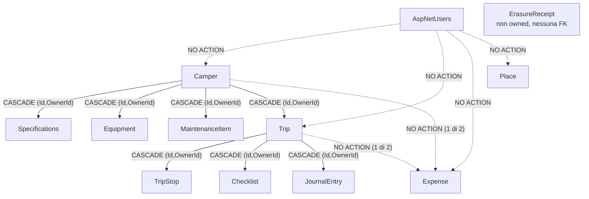

# ADR-0004 — Privacy, export e cancellazione: topologia delle FK decisa ora, codice dopo

- **Stato:** Accettato
- **Data:** 2026-09-24
- **Owner:** @sentinel
- **Decisore:** utente
- **Severità:** HIGH
- **Chiude:** decisione #4 · finding C4 della review

---

## Contesto

Roamly tratta **posizione geografica storica, foto, spese, abitudini di viaggio**, e in `FEATURES.md` §9 dichiara di costruire un **profilo di preferenze inferito**. Messo in fila: è un **profilo comportamentale geolocalizzato di una persona fisica**. Il planning originale non conteneva una riga su privacy, export o cancellazione — da qui il finding C4.

### Perché C4 è bloccante, e non "da fare prima del lancio"

L'istinto è rimandare: export e cancellazione sembrano feature di fine progetto, scrivibili quando il dominio è stabile. È un errore, e il motivo è preciso.

> **La parte irreversibile di questa decisione non è il codice di export e di cancellazione. È la topologia delle foreign key e il layout delle chiavi di storage.**

Il codice che serializza un utente in uno ZIP si scrive in un pomeriggio, in qualunque momento della vita del progetto, e si riscrive senza dolore. Ciò che **non** si riscrive senza dolore è:

- il **grafo di cancellazione**: quali FK sono `ON DELETE CASCADE`, quali sono `NO ACTION`, e in che direzione. Cambiarlo dopo significa una migration che droppa e ricrea ogni constraint dello schema, su dati reali, con un `Down()` da provare;
- il fatto che SQL Server **rifiuta** (errore 1785) più cascade path tra le stesse due tabelle. Non è una preferenza di design: è un vincolo del motore che si scopre alla prima migration sbagliata e che si risolve solo cambiando la topologia;
- il **layout delle chiavi di storage** (decisione #8): se le chiavi degli oggetti non sono owner-prefixed dal primo file caricato, la cancellazione di un account diventa una scansione del bucket invece di un prefix-delete, e la riconciliazione degli orfani non è esprimibile;
- la presenza di `OwnerId` e `CreatedAtUtc` su **ogni** entità owned: senza il primo l'export non è calcolabile, senza il secondo nessuna politica di retention è esprimibile a posteriori.

Questa decisione, quindi, **non implementa la privacy**. Decide la forma dello schema in modo che la privacy sia implementabile dopo a costo lineare invece che a costo di rifacimento. È la stessa logica dell'ADR-0001 — scegliere la direzione reversibile — applicata a un dominio diverso.

### Riformulazione del problema

La domanda **non** è "quali feature GDPR mettiamo nell'MVP".
La domanda è: **quali vincoli devono essere veri nella prima migration perché le feature GDPR restino scrivibili in un pomeriggio anche fra due anni e quaranta entità?**

Tutto ciò che non risponde a questa domanda è rimandabile. Tutto ciò che vi risponde è bloccante, indipendentemente da quanto sia piccolo.

### Vincoli reali

Sviluppatore singolo, nessuna review esterna, nessun budget legale, nessun DPO, MVP 1.0 con cinque schermate. Non esiste margine per un impianto di compliance formale, e proporlo sarebbe overengineering da manuale. Esiste però un margine — piccolo — per **non chiudersi le porte**.

---

## Fatti verificati, non verificati e falsi

Questa tabella è, come in ADR-0003, il contenuto informativo principale. La colonna "Esito" distingue ciò che è stato verificato su documentazione primaria da ciò che è giudizio o assunzione.

### Tecnici — EF Core 10

| Fatto | Esito | Fonte / nota |
|---|---|---|
| EF Core 10 introduce i **named query filters**: più filtri sulla stessa entità, ciascuno con una chiave, **combinati in AND** | ✅ verificato | Microsoft Learn, What's New in EF Core 10. È ciò che rende possibile affiancare un eventuale filtro di retention a `"OwnerScope"` senza distruggerlo |
| `HasQueryFilter(expression)` **senza nome** non aggiunge: **sostituisce** il filtro anonimo esistente. Due chiamate senza nome sulla stessa entità → **sopravvive solo la seconda, in silenzio** | ✅ verificato | Comportamento storico di EF, confermato in EF 10 per il filtro senza chiave. **È il gotcha che uccide l'opzione 4** |
| `IgnoreQueryFilters` ha **esattamente due firme**: `IgnoreQueryFilters()` e `IgnoreQueryFilters(IEnumerable<string> filterKeys)`. **Non esiste un overload che accetti una singola stringa** | ✅ verificato | API reference. ⚠️ **ADR-0003 contiene la forma sbagliata** (`IgnoreQueryFilters("OwnerScope")`) — corretta qui in §Emendamento |
| Il query filter **non** si applica a `Attach`/`Update`/`Remove`, al change tracker, né a `ExecuteUpdate`/`ExecuteDelete` | ✅ verificato | già in ADR-0003, ribadito perché la cancellazione è esattamente un'operazione di massa |
| **Navigazione required + filtro sul principal → EF genera `INNER JOIN`.** Se il principal è filtrato via, **il dependent sparisce dal risultato** anche se non è esso stesso filtrato | ✅ verificato | Documentato da Microsoft come limitazione nota dei query filter. Conseguenza: un soft delete sul padre fa sparire i figli in lettura ma **non** li cancella nel database |
| Il filtro accetta un **campo di istanza del DbContext**; EF lo parametrizza per query | ✅ verificato | già usato in ADR-0003 per `ICurrentUser` |

### Tecnici — SQL Server

| Fatto | Esito | Fonte / nota |
|---|---|---|
| SQL Server **errore 1785**: *"Introducing FOREIGN KEY constraint ... may cause cycles or multiple cascade paths"*. Il motore rifiuta la creazione della constraint se esistono **più percorsi di cascade** tra le stesse due tabelle | ✅ verificato | Documentazione SQL Server. **È il vincolo che detta la topologia**, non una linea guida |
| Con `OwnerId` denormalizzato su ogni entità (ADR-0003), ogni entità figlia ha **almeno due percorsi** verso `AspNetUsers`: quello diretto via `OwnerId` e quello gerarchico via il padre → **l'errore 1785 è la configurazione di default**, non un caso limite | ✅ verificato per deduzione dai due fatti precedenti | è il motivo per cui `OwnerId → AspNetUsers` deve essere `NO ACTION` |
| `ON DELETE NO ACTION` **non** impedisce la cancellazione: impedisce la cancellazione *del principal finché esistono dependent*. La cancellazione resta possibile se l'ordine è controllato dall'applicazione | ✅ verificato | è precisamente ciò che rende il job di cancellazione un requisito e non un lusso |
| `DELETE` di massa su tabelle con FK e trigger di cascade profondi può essere lento e produrre lock escalation | ⚠️ **non misurato** | irrilevante alla scala di un singolo utente (ordine delle migliaia di righe). Diventa rilevante solo se la cancellazione fosse mai massiva |

### Legali — **tutto ciò che segue non è consulenza legale**

> ⚠️ **Dichiarazione esplicita.** Io sono un agente di sicurezza tecnica. Le voci seguenti sono la mia lettura del testo del GDPR applicata al contesto di Roamly. Non sostituiscono il parere di un legale, e nessuna di esse deve essere trattata come un fatto verificato allo stesso titolo di quelli tecnici sopra.

| Affermazione | Esito | Nota |
|---|---|---|
| Gli artt. 15 e 20 (accesso e portabilità) richiedono di fornire i dati in un formato **strutturato, di uso comune e leggibile da dispositivo automatico** | ⚠️ lettura del testo, non parere legale | è ciò che rende JSON in uno ZIP una risposta difendibile e una UI curata non necessaria nell'MVP |
| L'art. 17 (cancellazione) richiede la cancellazione, non la marcatura come cancellato | ⚠️ lettura del testo | **è l'argomento che affonda il soft delete globale**, ma è un argomento legale, non tecnico. Va detto |
| L'art. 30 (registro dei trattamenti) contiene un'esenzione per organizzazioni con **meno di 250 dipendenti** | ⚠️ **verificato nel testo ma la sfumatura conta**: l'esenzione **decade** se il trattamento non è occasionale, se presenta un rischio per i diritti, o se riguarda categorie particolari di dati. Un trattamento continuativo di dati di **posizione** con profilazione inferita rientra plausibilmente nelle eccezioni → l'esenzione **probabilmente non si applica a Roamly**. Non è certo, ed è una valutazione legale |
| Serve una **DPIA** (art. 35) | ⚠️ **è un giudizio, non un fatto.** Art. 35 la richiede per "monitoraggio sistematico su larga scala". Roamly *tratta* dati di localizzazione e profila, ma "larga scala" con zero utenti non si sostiene. La mia valutazione: **non obbligatoria oggi, plausibilmente obbligatoria a un numero di utenti non banale.** È un trigger, non un requisito MVP |
| Una base giuridica va identificata prima della raccolta | ⚠️ lettura del testo | per le funzioni core (gestione camper, viaggi, manutenzioni) la base plausibile è **l'esecuzione del contratto**; per la profilazione inferita e per gli invii a terze parti **plausibilmente il consenso**. È esattamente la distinzione che rende la tabella consensi non necessaria finché non esistono terze parti |
| L'hosting dei dati fuori dallo SEE richiede garanzie aggiuntive | ⚠️ lettura del testo, **non indagato** | dipende dalla #9, oggi aperta |
| Costo, deliverability e trattamento dati del provider email | ❌ **non indagato** | eredità di ADR-0003, ancora aperta. È l'unico terzo **obbligatorio** nell'MVP, perché Identity non funziona senza |

### Di prodotto

| Affermazione | Esito |
|---|---|
| L'MVP 1.0 (Login → Create Camper → Dashboard → Add Maintenance → Reminder) **non contiene upload di file** | ✅ confermato dall'utente in questa decisione: i Documenti del camper escono dalla Phase 1 |
| Nessun servizio terzo prima della Phase 4, **eccetto il provider email** | ✅ confermato dall'utente |
| Il numero di utenti dell'MVP è ~1 (lo sviluppatore) e cresce lentamente | ⚠️ assunzione, ragionevole ma non garantita. È la premessa di metà delle scelte qui sotto |

---

## Opzioni considerate

### Opzione 1 — Minimalista: nessuna feature, cancellazione manuale

Nessun endpoint di export, nessun endpoint di cancellazione. Una riga nell'informativa che dice "scrivi a questo indirizzo" e, quando qualcuno scrive, si apre SSMS.

**Pro:** costo zero oggi. Zero superficie di attacco aggiuntiva. Zero codice da mantenere. Per un'app con un utente è tecnicamente sufficiente.

**Contro:** **non risolve il problema reale.** La cancellazione manuale in SSMS su uno schema con `NO ACTION` ovunque e venti tabelle è un esercizio di ordine topologico fatto a mano alle 23:00, e la modalità di fallimento è "ho dimenticato una tabella" — cioè dati personali che sopravvivono a una cancellazione che è stata dichiarata eseguita. Soprattutto: **non impone nulla sullo schema**, quindi la topologia delle FK resta quella che viene, e il problema irreversibile non viene toccato. È l'opzione che confonde "non scrivere la feature" con "non prendere la decisione".

**Costo di inversione: ALTO**, perché l'inversione richiede di rifare lo schema.

### Opzione 2 — Topologia decisa ora, feature minima, verificatori automatici ⭐ **SCELTA**

Si fissano nella prima migration la topologia delle FK, il layout delle chiavi e i campi obbligatori. Si scrivono due endpoint sottili (export, richiesta di cancellazione) e un job. Si aggiungono tre regole invarianti **R8/R9/R10** con verificatore automatico, nella stessa forma di R1-R7.

**Pro:** paga solo ciò che è irreversibile. L'export è derivato dal **modello EF**, quindi non invecchia quando si aggiungono entità. I verificatori rompono la build quando qualcuno dimentica, invece di affidarsi alla memoria. Nessuna dipendenza esterna nuova.

**Contro:** costa ~2-3 giorni prima della prima slice di dominio, su un MVP che non ne ha bisogno funzionalmente. Introduce un job in più da far girare e da monitorare. L'export prodotto è machine-readable e spoglio.

**Costo di inversione: BASSO** in avanti (aggiungere una UI curata, un formato migliore, l'anonimizzazione) — **la topologia è il pezzo costoso e viene pagato ora.**

### Opzione 3 — Impianto di compliance completo

Opzione 2 più: tabella `UserConsent` con versioning delle finalità, tabella `SecurityEvent` su database con job di purge, audit trail completo delle modifiche, anonimizzazione al posto della cancellazione, ROPA formale, DPIA redatta.

**Pro:** è ciò che servirebbe a un prodotto con utenti reali e un'azienda dietro. Nessuna delle sue parti è sbagliata in assoluto.

**Contro:** **la tabella dei consensi è struttura senza contenuto finché non esiste nulla a cui consentire.** Con zero terze parti oltre al provider email — che è necessario all'esecuzione del contratto, non una scelta dell'utente — la tabella registrerebbe consensi a niente. La stessa obiezione fatta a B3 in ADR-0003 vale identica qui: modellare un meccanismo prima che esista la semantica produce un meccanismo che verrà modellato male, perché lo si modella senza il caso d'uso davanti. `SecurityEvent` su DB aggiunge una tabella, un job di purge, un indice e un problema di crescita per ottenere ciò che la pipeline di logging già fa. La DPIA a zero utenti è un documento scritto per un rischio che non esiste ancora.

**Costo di inversione: MEDIO-ALTO** — una volta introdotta, una tabella consensi va mantenuta, migrata e interpretata anche quando si scopre che la semantica giusta era un'altra.

### Opzione 4 — Soft delete globale — **respinta**

`IsDeleted` + `DeletedAtUtc` su ogni entità, filtro globale aggiuntivo, cancellazione = update. Purga fisica differita, eventualmente mai.

È l'opzione che viene in mente per prima, perché sembra la più prudente: niente è mai perso davvero.

**Respinta per due motivi indipendenti, ciascuno sufficiente.**

**Primo, sostanziale.** Si conserverebbero **esattamente i dati che si è dichiarato all'utente di aver cancellato**. Il soft delete è conservazione con una bandierina. Chiamarla cancellazione nell'informativa e poi conservare le righe è una discrepanza tra ciò che si dice e ciò che si fa, ed è il tipo di discrepanza che non si nota finché non conta. ⚠️ *La valutazione della sua conformità all'art. 17 è legale, non tecnica, e non la do.* Ma sul piano dell'onestà del sistema, il giudizio è tecnico e netto: **un sistema che dice "cancellato" e conserva è un sistema che mente ai suoi stessi log.**

**Secondo, tecnico, e più insidioso.** Il soft delete globale è **fragile nell'esatto punto in cui ADR-0003 ha costruito la sicurezza**:

- un `HasQueryFilter` **senza nome** aggiunto per `IsDeleted` **sovrascrive silenziosamente** un filtro anonimo preesistente. In EF 10 il problema è mitigabile usando sempre filtri nominati, ma la mitigazione **dipende dal ricordarsi di nominarli** — cioè viola il criterio guida di ADR-0003. Il fallimento non è una build rotta: è ownership disattivata senza alcun segnale;
- il gotcha **navigazione required + filtro → `INNER JOIN`** rende il comportamento dei figli di un padre soft-deleted dipendente dalla nullabilità della navigazione, cioè da un dettaglio di modellazione che cambia slice per slice. Il risultato è che "cosa si vede dopo un soft delete" non è una proprietà del sistema ma una proprietà di ogni singola query;
- ogni indice unique deve includere `IsDeleted` o smettere di essere unique nel modo atteso;
- il filtro di ownership e il filtro di soft delete **si combinano in AND**, quindi `IgnoreQueryFilters()` senza argomenti — che qualcuno prima o poi scriverà per "vedere anche i cancellati" — **disattiva anche l'ownership**. Le due firme disponibili rendono l'errore facilissimo: `IgnoreQueryFilters()` è più corto da scrivere di `IgnoreQueryFilters(["SoftDelete"])`.

> Un meccanismo di sicurezza e un meccanismo di ciclo di vita del dato che condividono lo stesso punto di estensione, con una modalità di fallimento silenziosa, sono una combinazione da evitare. **Il soft delete non è respinto perché cattivo in assoluto: è respinto perché in questo schema convive male con la sola cosa che protegge gli utenti.**

Resta ammesso — e solo lì — il **soft delete locale a una singola entità**, se una feature di prodotto lo richiede esplicitamente (es. un cestino per il journal), con filtro **nominato** e dichiarato nel modello. Non è la stessa cosa di una politica globale.

---

## Decisione

1. **Topologia delle foreign key fissata ora**, nella forma descritta in §Impatto sullo schema. `OwnerId → AspNetUsers` è `ON DELETE NO ACTION` su **tutte** le entità owned; il cascade esiste **solo** lungo la gerarchia di dominio; **una sola cascade path per coppia di tabelle**.
2. **Export model-driven.** `GET /api/v1/me/export` produce uno **ZIP** contenente un file JSON per tipo di entità owned più un `manifest.json`. L'insieme delle entità esportate è **derivato da `DbContext.Model` a runtime**, non da una lista scritta a mano.
3. **Hard delete con periodo di grazia di 30 giorni.** `POST /api/v1/me/deletion` registra la richiesta; l'account viene immediatamente reso inaccessibile; `DELETE /api/v1/me/deletion` la revoca entro la grazia. Alla scadenza, `AccountErasureJob` esegue la cancellazione **fisica** in ordine topologico e termina con l'emissione di una `ErasureReceipt`.
4. **Regole invarianti R8, R9, R10**, ciascuna con un verificatore automatico, nella stessa forma di R1-R7 in `SECURITY.md` §2.2.
5. **Vincoli F1-F7** dichiarati come **requisiti di verifica per la decisione #8**. `StoredFile` **non entra** nello schema MVP: i Documenti del camper sono fuori dalla Phase 1.
6. **`ICurrentUser` acquisisce un quarto modo: `RunAsUser(userId, "motivo")`**, e la descrizione di `RunAsSystem` in ADR-0003 viene corretta (§Emendamento).
7. **Nessuna tabella dei consensi, nessuna tabella `SecurityEvent`, nessun job di purge dei log.** Gli eventi di sicurezza vivono sulla **pipeline di logging strutturato**, con retention configurata **nel sink**.
8. **Informativa** come contenuto statico versionato, con la versione vista registrata su `User` (`PrivacyPolicyVersionSeen`). Non è un consenso: è una traccia di quale testo l'utente ha visto.
9. **DPIA, ROPA formale, anonimizzazione, audit trail e UI curata dell'export: fuori dall'MVP**, con trigger dichiarati.

---

## Regole invarianti — R8, R9, R10

Stessa forma di `SECURITY.md` §2.2. Il criterio guida è **invariato**:

> **Nessun requisito deve dipendere dalla memoria dello sviluppatore.**

Una regola di privacy che si applica "ricordandosi di aggiungere la nuova entità all'export" non è una regola: è un proposito. La differenza tra le due è che la prima rompe la build.

| # | Regola | Verificata da |
|---|---|---|
| **R8** | **Copertura universale.** Ogni entità owned presente in `DbContext.Model` deve essere **raggiungibile** sia dal grafo di export sia dal grafo di cancellazione. Entrambi i grafi sono **derivati dal modello a runtime**, mai da una lista letterale. Un'entità può essere esclusa **solo** iscrivendola a una whitelist esplicita con motivazione | test di convenzione sul modello EF (**bloccante**): confronta l'insieme delle entità owned con l'insieme coperto; una nuova entità non coperta e non in whitelist **rompe la build** |
| **R9** | **Cancellazione effettiva.** Dopo l'esecuzione di `AccountErasureJob` per un utente, **nessuna riga con quel `OwnerId` sopravvive in alcuna tabella owned**, e nessuna FK resta pendente verso il principal cancellato | integration test "erase and sweep" (**bloccante**): popola un utente con almeno una riga per **ogni** tipo di entità owned usando i test data builder, esegue il job, poi **itera sul modello** verificando `COUNT(*) = 0` per ciascuna entità. Richiede un database reale → **dipende dalla #6** |
| **R10** | **Residuo non personale.** Ciò che sopravvive alla cancellazione è **solo** non-owned e privo di identificatori diretti dell'utente: la `ErasureReceipt` (identificativo **pseudonimizzato**, timestamp, versione dello schema, conteggi) e i log di sicurezza, la cui retention è configurata nel sink. Nessuna entità non-owned può contenere un riferimento diretto a un utente cancellato | test di convenzione sulla **whitelist delle entità non-owned**: ogni entità non-owned deve essere dichiarata esplicitamente e annotata; il test fallisce se compare un'entità non-owned non dichiarata, o se `ErasureReceipt` acquisisce una FK verso `AspNetUsers` |

La regola è soddisfatta quando **tutti e tre** i verificatori sono verdi, e **nessuno dei tre dipende dalla memoria di chi aggiunge un'entità**.

### Perché R8 è la più importante delle tre

R9 e R10 verificano che la cancellazione di oggi funzioni. **R8 verifica che la cancellazione di domani funzioni ancora.**

Il fallimento che R8 intercetta è l'unico che conta davvero su un progetto lungo: in Phase 2 si aggiunge `JournalEntry`, la slice funziona, i test passano, l'ADR non viene riletto — e per i successivi due anni l'export di un utente non contiene il suo diario di viaggio e la cancellazione lo lascia nel database. Nessun errore, nessun log, nessun sintomo. È la stessa forma di fallimento dell'IDOR che ADR-0003 chiude: **silenzioso, e visibile solo a chi lo cerca.**

Il costo di R8 è basso proprio perché è model-driven: derivare l'elenco delle entità owned da `DbContext.Model` è lo stesso loop che già esiste in `OnModelCreating` per applicare il filtro `"OwnerScope"`. Si riusa l'infrastruttura di R1/R2.

### Nota sul tipo di verificatore

R8 e R10 sono **test di convenzione** (veloci, senza database, bloccanti in CI come quelli di R1/R2). R9 è un **integration test** e paga il prezzo del database reale: gira, ma non a ogni salvataggio. Questa asimmetria è deliberata — il verificatore che protegge il futuro deve essere il più economico dei tre, altrimenti viene disattivato.

---

## Vincoli F1-F7 — requisiti di verifica per la decisione #8

> **Questi non sono entità da creare ora.** `StoredFile` **non entra** nello schema MVP, perché i Documenti del camper sono fuori dalla Phase 1. F1-F7 sono i requisiti che la decisione #8 dovrà soddisfare, dichiarati **adesso** perché il momento in cui verranno ignorati è precisamente il momento in cui verranno scritti senza averli davanti.

| # | Vincolo | Perché |
|---|---|---|
| **F1** | **Chiavi owner-prefixed.** La chiave di ogni oggetto deve iniziare con l'identificativo del proprietario: `{ownerId}/{tipoEntità}/{entityId}/{fileId}`. La cancellazione di un account deve essere esprimibile come **prefix-delete**, non come scansione del bucket | è la controparte, nello storage, di `OwnerId` denormalizzato. Senza, la cancellazione dipende dalla completezza di una lista nel database — e se quella lista è incompleta, gli orfani sono invisibili |
| **F2** | **Riconciliazione bidirezionale.** Deve esistere un verificatore che rilevi sia gli oggetti senza riga corrispondente nel database, sia le righe che puntano a oggetti inesistenti | la coerenza tra due sistemi di persistenza senza transazione comune **non è mai garantita**: o è verificata, o è sperata |
| **F3** | **Export incluso.** I binari devono entrare nello **stesso ZIP** dell'export model-driven, oppure l'export deve dichiarare esplicitamente URL a tempo con scadenza indicata nel manifest. Non due meccanismi diversi | un export che copre il database ma non le foto è un export che dice di essere completo e non lo è |
| **F4** | **Hard delete reale lato provider.** La cancellazione deve rimuovere l'oggetto, non spostarlo in uno stato recuperabile che sopravvive al periodo di grazia | ⚠️ **requisito di verifica, non affermazione.** Il comportamento di soft delete, versioning, retention policy e recycle bin **varia per provider ed è spesso attivabile o attivo per default**. Non ho verificato il comportamento di alcun provider specifico, perché il provider non è scelto. **La #8 deve verificarlo esplicitamente e documentarlo**, non assumerlo |
| **F5** | **Backup e retention dichiarati.** I backup del provider e del database **sopravvivono** alla cancellazione. La finestra va misurata, dichiarata nell'informativa e allineata alla grazia | ⚠️ è in parte un requisito legale/organizzativo, non tecnico. Il punto tecnico è che la finestra sia **nota**; ciò che se ne dichiara all'utente non è una mia competenza |
| **F6** | **URL firmati owner-checked, a scadenza breve.** La firma si emette solo dopo una verifica di ownership fatta nell'applicazione; mai serving diretto dall'API; la durata della firma deve essere ≪ del periodo di grazia | eredità diretta di ADR-0003 §2.6: **R1-R7 si fermano al confine del database**, e ora R8-R10 si fermano allo stesso confine |
| **F7** | **Cancellazione idempotente e osservabile.** Lo sweep dello storage deve poter essere rieseguito senza effetti collaterali, e un fallimento parziale deve essere visibile: **la `ErasureReceipt` non viene emessa finché lo sweep dello storage non è confermato** | senza questo, la ricevuta attesta una cancellazione che potrebbe non essere avvenuta — che è peggio di non avere ricevuta |

---

## Impatto sullo schema del database

Questa è la parte irreversibile. Elenco concreto di ciò che la **prima migration** deve contenere.

### Su ogni entità owned

| Elemento | Forma | Nota |
|---|---|---|
| `OwnerId` | `Guid` (o tipo scelto per la PK), **NOT NULL** | già imposto da R1 (ADR-0003) |
| **FK `OwnerId → AspNetUsers(Id)`** | **`ON DELETE NO ACTION`** — senza eccezioni | è il cuore di questa decisione, vedi sotto |
| `CreatedAtUtc` | `datetime2`, **NOT NULL**, UTC | **obbligatorio su ogni entità owned.** Senza, nessuna politica di retention è esprimibile a posteriori e nessun export è ordinabile. Costa 8 byte per riga; aggiungerlo dopo costa una migration con backfill su dati per cui il valore vero **non esiste più** |
| Indici | `OwnerId` come **prima colonna** | già imposto da ADR-0003 |
| FK verso il padre | **composita** `(ParentId, OwnerId) → Parent(Id, OwnerId)` | già imposto da R4. **Questa è la FK su cui vive il cascade** |

### Regole sulle foreign key

1. **`OwnerId → AspNetUsers` è sempre `ON DELETE NO ACTION`.** Non è una preferenza. Con `OwnerId` denormalizzato su ogni figlio, ogni entità figlia avrebbe **due** percorsi verso `AspNetUsers` — quello diretto e quello via il padre — e SQL Server rifiuta la configurazione con l'**errore 1785**. `NO ACTION` sul percorso diretto lascia un solo percorso di cascade, quello gerarchico.
2. **Il cascade esiste solo lungo la gerarchia di dominio**: `Camper → MaintenanceItem`, `Camper → Equipment`, `Trip → TripStop`, e così via, tramite le FK composite.
3. **Una sola cascade path per coppia di tabelle.** Dove il dominio ne suggerirebbe due (il caso da tenere d'occhio è `Expense`, agganciabile a `Camper` **o** a `Trip`), **entrambe le FK opzionali sono `NO ACTION`** e la cancellazione di `Expense` è responsabilità esplicita del job. Non si tenta di essere furbi con i trigger.
4. **Conseguenza operativa, dichiarata:** `NO ACTION` significa che **`DELETE FROM AspNetUsers WHERE Id = @x` fallisce** finché esistono righe owned. La cancellazione di un account **non è un `DELETE` singolo**: è una sequenza ordinata. Questo rende `AccountErasureJob` un requisito, non una comodità — ed è la ragione per cui l'Opzione 1 (cancellazione manuale) è peggiore di quanto sembri.

### Sulla tabella `User` (estensione di `IdentityUser`)

| Colonna | Tipo | Semantica |
|---|---|---|
| `DeletionRequestedAtUtc` | `datetime2` **NULL** | quando l'utente ha chiesto la cancellazione. `NULL` = nessuna richiesta attiva |
| `DeletionScheduledForUtc` | `datetime2` **NULL** | `DeletionRequestedAtUtc + 30 giorni`. **Colonna persistita, non calcolata**: se un domani la grazia cambiasse, le richieste già in corso devono mantenere la scadenza promessa all'utente quando l'hanno fatta |
| `PrivacyPolicyVersionSeen` | `nvarchar(32)` **NULL** | versione dell'informativa mostrata. **Non è un consenso.** È una traccia di quale testo l'utente ha visto, utile se il testo cambia |

Indice filtrato su `DeletionScheduledForUtc` (`WHERE DeletionScheduledForUtc IS NOT NULL`): il job interroga questa colonna ogni giorno e la stragrande maggioranza delle righe è `NULL`.

### Sulla nuova entità `ErasureReceipt` — **non owned**

| Colonna | Tipo | Nota |
|---|---|---|
| `Id` | PK | |
| `SubjectHash` | `nvarchar(64)` NOT NULL | **hash** dell'identificativo utente, non l'identificativo. Serve a rispondere "è stata eseguita?" senza conservare a chi si riferisce |
| `RequestedAtUtc`, `ErasedAtUtc` | `datetime2` NOT NULL | |
| `SchemaVersion` | `nvarchar(32)` NOT NULL | quale versione del grafo di cancellazione è stata applicata |
| `DeletedRowCounts` | `nvarchar(max)` NOT NULL | JSON: conteggi per entità. Diagnostico, non personale |
| `StorageSweepConfirmed` | `bit` NOT NULL | oggi sempre `true` (nessuno storage in Phase 1); previsto da **F7** |

**`ErasureReceipt` non ha FK verso `AspNetUsers` e non implementa `IOwnedResource`.** È deliberato: una ricevuta con una FK verso l'utente sarebbe cancellata insieme all'utente, cioè sarebbe inutile. Entra nella whitelist esplicita di R1 e nella whitelist di R10.

> ⚠️ **Limite dichiarato:** `SubjectHash` è pseudonimizzazione, non anonimizzazione. Chi conosce l'identificativo di un utente può verificare se compare tra le ricevute. Accettato: l'alternativa — nessuna ricevuta — rende impossibile dimostrare di aver eseguito una cancellazione.

### Sul tipo della chiave primaria

Questa decisione **aggrava** la lacuna §3.8 di `CONTEXT.md`: il grafo di cancellazione percorre le FK composite, quindi il tipo della PK influenza sia la dimensione delle constraint sia il costo del `DELETE` ordinato. Resta di @oracle, resta da chiudere prima della prima migration.

---

## Il grafo di cancellazione



**Legenda e motivazioni:**

- **Linee tratteggiate = `NO ACTION`.** Ogni arco da `AspNetUsers` è tratteggiato per il motivo dell'errore 1785: il percorso diretto via `OwnerId` coesiste sempre con il percorso gerarchico, e il motore ne tollera **uno solo**.
- **Linee piene = `CASCADE` sulla FK composita `(ParentId, OwnerId)`.** È lo stesso constraint che implementa R4: **una sola FK serve due scopi**, impedire la divergenza di `OwnerId` e propagare la cancellazione. Non c'è costo aggiuntivo rispetto ad ADR-0003.
- **`Expense` ha entrambe le FK in `NO ACTION`**, perché due cascade path convergenti sulla stessa tabella sono proprio ciò che l'errore 1785 vieta. La sua cancellazione è esplicita nel job. ⚠️ Se @archimedes chiudesse §3.3 di `CONTEXT.md` scegliendo "una tabella per contesto" (`CamperExpense` / `TripExpense`), il vincolo **decade** e quelle due tabelle possono tornare in cascade. **Questa decisione non pregiudica la scelta di modellazione.**
- **`Place`** è tratteggiato e isolato perché §3.2 di `CONTEXT.md` è ancora aperta: se `Place` diventasse un POI condiviso, uscirebbe da `IOwnedResource` e da questo grafo — ed è un caso che va gestito, non scoperto.

**Ordine di esecuzione del job:** foglie → radice, con `AspNetUsers` per ultimo. La forma esatta dell'ordinamento è derivabile dal modello (`IEntityType.GetForeignKeys()`), quindi **si calcola, non si scrive a mano**. È la stessa logica di R8: una lista scritta a mano invecchia, un ordinamento topologico derivato no.

Questo contenuto è destinato a `DATA.md` §6.

---

## Emendamento ad ADR-0003

Questa decisione ha smascherato **due errori** in ADR-0003. Poiché un ADR accettato **non si modifica** (`ADR-FORMAT.md`), le correzioni vivono qui e ADR-0003 va letto insieme a questa sezione.

### Correzione 1 — la firma di `IgnoreQueryFilters`

ADR-0003 scrive, in §"`ICurrentUser` fuori da HTTP" e nella tabella dei fatti verificati:

> `IgnoreQueryFilters("OwnerScope")`

**Questa forma non compila.** Esistono esattamente due firme:

```csharp
IgnoreQueryFilters()                              // disattiva TUTTI i filtri
IgnoreQueryFilters(IEnumerable<string> filterKeys) // disattiva i filtri nominati
```

La forma corretta è:

```csharp
IgnoreQueryFilters(["OwnerScope"])
```

L'errore è banale da correggere ma **non è innocuo**, perché la firma sbagliata suggerisce una cosa falsa: che disattivare un filtro specifico sia il gesto più naturale. In realtà il gesto più breve — e quindi quello che verrà scritto sotto pressione — è `IgnoreQueryFilters()` **senza argomenti**, che disattiva tutto. Per questo `IgnoreQueryFilters` resta bandito da `BannedApiAnalyzers` (R5) **in entrambe le forme**, e ogni deroga dentro `Common/Ownership/` deve usare la forma con le chiavi esplicite.

### Correzione 2 — cosa fa davvero `RunAsSystem`

ADR-0003 descrive `RunAsSystem` così:

> *"...che attiva `IgnoreQueryFilters("OwnerScope")` **solo dentro quello scope**"*

**È tecnicamente falso.** `IgnoreQueryFilters` è un operatore **di query**, applicato a una `IQueryable` in un punto preciso del codice. Non esiste un modo per "attivarlo ambientalmente" per tutte le query dentro uno scope. La frase descrive un comportamento che EF non offre.

Ci sono due modi reali di ottenere qualcosa di simile, e **vanno distinti**, perché uno dei due è molto peggiore dell'altro.

#### Implementazione (a) — predicato con disgiunzione — ❌ **la più pericolosa, respinta**

```csharp
// NON adottata
HasQueryFilter("OwnerScope", e => _currentUser.IsSystem || e.OwnerId == _currentUser.UserId);
```

Funziona. Ed è **la peggiore delle due**, per ragioni che si sommano:

1. **È fail-open.** Il flag `IsSystem` è uno stato ambientale su un servizio scoped. Se quello stato è `true` quando non dovrebbe — `using` dimenticato, scope riusato, flusso asincrono che attraversa il boundary, eccezione che salta il dispose, scope annidati — **ogni query dell'applicazione restituisce i dati di tutti gli utenti**. Nessuna eccezione, nessun log, nessun test rosso: solo più righe del previsto. ADR-0003 ha costruito l'intero impianto sul principio **fail-closed** ("identità assente = eccezione, mai insieme vuoto"). Questa implementazione lo inverte nel punto più delicato.
2. **È globale e indiscriminata.** Non allenta il filtro su un'entità o su una query: lo allenta su **tutte le entità per tutta la durata dello scope**. Un job che deve leggere una tabella ottiene il permesso di leggerle tutte.
3. **È invisibile nel diff.** Un'escape hatch scritta con `IgnoreQueryFilters(["OwnerScope"])` compare nel codice, è bandita dall'analyzer, va inserita in una whitelist e **si vede nella code review**. Un flag ambientale non compare da nessuna parte: il punto in cui la sicurezza si disattiva e il punto in cui si leggono i dati sono in file diversi, scritti in momenti diversi.
4. **Inquina la query.** Il flag entra nell'SQL come parametro (`WHERE @isSystem = 1 OR OwnerId = @me`), quindi il piano generato è lo stesso per entrambi i casi — subottimale per entrambi — e il predicato di ownership smette di essere un semplice seek.

> Il punto 3 è quello decisivo. ADR-0003 ha scelto B4 su B2 perché *"nessuno dei tre livelli dipende dalla memoria dello sviluppatore"* e perché *"l'eccezione è consentita ma è contata, e il contatore è un test"*. Un flag ambientale **non è contabile**: non c'è niente da contare. Adottare (a) significherebbe reintrodurre, sotto forma di stato, esattamente la fragilità che l'analyzer era stato scelto per eliminare.

#### Implementazione (b) — escape esplicito per call-site — ✅ **adottata**

`RunAsSystem("motivo")` **non tocca il filtro.** Dichiara un'identità di tipo *sistema*, e questa identità produce due effetti:

- una query owner-scoped eseguita sotto identità di sistema **lancia**, perché non esiste un `UserId` da confrontare (coerente con R6: fail-closed);
- il codice dentro `Common/Ownership/` — **e solo lì** — è autorizzato a scrivere `IgnoreQueryFilters(["OwnerScope"])` su una query specifica, sotto deroga `#pragma`, contata dalla whitelist di R5.

Il risultato è che l'allentamento della sicurezza resta **puntuale, esplicito, greppabile, contato e visibile nel diff**. Costa più righe. È il punto.

### Aggiunta — `RunAsUser(userId, "motivo")`, quarto modo di `ICurrentUser`

`ICurrentUser` passa da tre a **quattro** modi:

| Modo | Uso | Filtro |
|---|---|---|
| **HTTP** | middleware dai claim | attivo, sull'utente della richiesta |
| **`RunAsUser(userId, "motivo")`** | 🆕 lavoro per conto di **un** utente identificato fuori da HTTP | **attivo, pieno**, sull'utente impersonato |
| **`RunAsSystem("motivo")`** | lavoro non riconducibile a un utente | nessuna identità → query owner-scoped **lanciano**; deroghe solo in `Common/Ownership/` |
| **Throwing** | design-time, migration | lancia sempre |

**Perché serve, e perché è la parte migliore di questa decisione.** Entrambi i job dell'MVP lavorano **per conto di un utente alla volta**:

- `MaintenanceReminderJob` calcola i reminder di *quell'* utente;
- `AccountErasureJob` cancella i dati di *quell'* utente.

Con `RunAsUser`, la sequenza è: *seleziona gli id degli utenti da processare* (una query su `AspNetUsers`, che non è owned) *→ per ciascuno, apri uno scope `RunAsUser` e lavora normalmente*. Dentro lo scope **il filtro `"OwnerScope"` è pienamente attivo e punta all'utente giusto**. Il job non ha alcun bisogno di disattivare niente.

> Questo capovolge il rischio. Con `RunAsSystem` il job cancella i dati di tutti gli utenti **tranne quelli che si ricorda di filtrare**. Con `RunAsUser` il job non è **in grado** di toccare i dati di un altro utente: un bug nel job produce un reminder mancante o una cancellazione incompleta — che R9 rileva — **non una cancellazione dei dati di qualcun altro.**

Un job di cancellazione è l'ultimo posto al mondo in cui si vuole un'identità con accesso a tutto. `RunAsUser` è il modo di non averla.

`RunAsSystem` resta per ciò che utente non ha: il polling di `AspNetUsers`, il seed, la scrittura della `ErasureReceipt`.

---

## Costo di inversione

| Scelta | Costo | Motivazione |
|---|---|---|
| **Topologia FK (`NO ACTION` verso `AspNetUsers`, cascade gerarchico, una sola path)** | 🔴 **ALTO** | migration che droppa e ricrea ogni constraint dello schema, su dati reali, con `Down()` da verificare. **È la ragione d'essere di questo ADR: si paga ora perché dopo non si paga, si soffre** |
| **`CreatedAtUtc` obbligatorio su ogni entità owned** | 🔴 **ALTO** (asimmetrico) | aggiungerla dopo è tecnicamente banale (`ALTER TABLE`), ma **il valore vero non esiste più**: il backfill può solo mentire. Come per le coordinate in ADR-0001, il dato non ricostruibile va catturato al momento in cui esiste |
| **Layout delle chiavi di storage (F1)** | 🔴 **ALTO** | rinominare gli oggetti già caricati significa copiare e cancellare ogni blob, con una finestra di incoerenza. È alto **anche se oggi non esiste storage**: diventa alto nel momento esatto in cui il primo file viene caricato |
| **Formato dell'export (ZIP + JSON model-driven)** | 🟢 **BASSO** | è codice di serializzazione dietro un endpoint. Cambiare formato, aggiungere CSV, curare la presentazione: nessun impatto su schema o dati |
| **Hard delete vs soft delete** | 🟠 **MEDIO, e asimmetrico nella direzione sbagliata** | passare da hard a soft è una migration additiva (colonne + filtri) → basso. Passare da soft a hard richiede di **cancellare davvero** dati che nel frattempo si sono accumulati, e di decidere cosa farne. **La direzione reversibile è quella scelta** |
| **Periodo di grazia di 30 giorni** | 🟢 **BASSO** | è un numero in configurazione. `DeletionScheduledForUtc` è persistita proprio perché cambiarlo non deve toccare le richieste in corso |
| **`RunAsUser` come quarto modo** | 🟢 **BASSO** | additivo su `ICurrentUser`, nessun impatto su schema o dati. Toglierlo costerebbe di più che averlo aggiunto |
| **Log di sicurezza sul sink invece che su DB** | 🟢 **BASSO** | se un domani servisse la query sugli eventi, si aggiunge una tabella e un sink che ci scrive. Nessun dato perso nel frattempo, a patto che la retention del sink sia configurata — **che è l'unica cosa da non dimenticare** |
| **Nessuna tabella consensi** | 🟢 **BASSO** | aggiungerla al primo terzo è una migration additiva su una tabella nuova. Nessuna riga esistente da migrare, perché non ci sono consensi da registrare retroattivamente per trattamenti che non sono avvenuti |
| **`ErasureReceipt` come entità non owned** | 🟠 **MEDIO** | cambiarne la forma dopo che sono state emesse ricevute significa migrare attestazioni. Basso volume, ma semanticamente delicato |

---

## Tradeoff negativi accettati

1. **L'export dell'MVP è machine-readable e non curato.** Uno ZIP con `campers.json`, `maintenance.json`, `manifest.json`. Un utente non tecnico che lo apre non ci capisce nulla. ⚠️ *La sufficienza rispetto all'art. 20 è una valutazione legale che non do*; sul piano tecnico è un formato strutturato e di uso comune, ma **è il minimo**, ed è stato scelto perché il minimo è ciò che si riesce a mantenere aggiornato automaticamente. Un export curato è un export scritto a mano, e un export scritto a mano invecchia — cioè è esattamente ciò che R8 esiste per impedire.
2. **L'hard delete è irreversibile e, oltre la grazia, non esiste rete applicativa.** Dopo 30 giorni i dati non si recuperano se non da un backup, e recuperarli da un backup significa ripristinare un database intero. Un utente che sbaglia e se ne accorge al giorno 31 ha perso tutto. **Questo è il prezzo di non aver scelto il soft delete, ed è reale.** La grazia di 30 giorni è l'unica mitigazione, ed è una mitigazione a tempo.
3. **Il periodo di grazia è a sua volta un compromesso, sfavorevole su entrambi i lati.** Trenta giorni sono lunghi per chi voleva sparire subito (i dati restano lì un mese dopo che l'utente ha chiesto di cancellarli) e corti per chi si pente tardi. Non esiste un numero giusto: c'è un numero, ed è configurabile.
4. **Si introduce un job che deve girare, e che nessuno guarda.** `AccountErasureJob` fallisce in silenzio se il deploy non ha uno scheduler funzionante. Una cancellazione promessa e non eseguita è peggio di una cancellazione non promessa. **Serve un health check su "esistono richieste scadute non processate", e oggi non c'è** — è lavoro per @vulcan sulla #9.
5. **R9 richiede un database reale, quindi questa decisione irrigidisce ulteriormente la #6.** Un test che verifica che non restino righe non ha alcun senso su un provider in-memory che non applica le FK. La #6 era già prerequisito pratico della #2; ora lo è due volte.
6. **`SubjectHash` è pseudonimizzazione, non anonimizzazione** (vedi §Impatto sullo schema). È un residuo, piccolo, dichiarato.
7. **Non esiste audit trail delle modifiche ai dati personali.** Non si saprà chi ha cambiato cosa e quando, al di là di `CreatedAtUtc`. Con un solo utente e nessun operatore è una scelta ragionevole; smette di esserlo nel momento in cui esiste un backoffice.
8. **La retention dei log di sicurezza dipende dalla configurazione di un sink, che vive fuori dal repository dell'applicazione.** È il punto debole della scelta di non usare una tabella: **non è verificabile da un test**. R10 verifica il database; non può verificare la configurazione del sink. Va presidiata da @vulcan nella #9, e va detto che questa è l'unica parte dell'impianto che dipende ancora da un atto di disciplina.
9. **Si scrive infrastruttura di privacy per un prodotto che ha un utente.** Due-tre giorni prima della prima slice di dominio, su feature che nessuno userà per mesi. **Se l'obiettivo fosse il minimo tempo assoluto all'MVP, l'Opzione 1 sarebbe la scelta giusta e questa sarebbe quella sbagliata.** La giustificazione è interamente nell'asimmetria del costo di inversione, non nel valore immediato.
10. **Questo ADR contiene affermazioni legali che non sono state validate da un legale.** Sono marcate ⚠️ una per una. Se anche una sola di esse fosse errata nel senso più restrittivo, l'impianto risulterebbe insufficiente — e questa decisione non ha modo di escluderlo.

---

## Trigger di revisione pre-approvati

Al verificarsi di **uno solo** di questi, la parte corrispondente va rivista **prima** di procedere.

1. **Arriva il primo servizio terzo oltre al provider email** (AI/Intelligence, mappe, meteo, analytics) → serve la **tabella dei consensi**, con finalità versionate e prova del consenso, più l'aggiornamento di `SECURITY.md` §4 sul confine dei dati verso l'AI. È il trigger più probabile: è atteso in Phase 4.
2. **I Documenti del camper (o qualunque upload) rientrano in Phase 1** → **F1-F7 diventano bloccanti** e la decisione #8 va chiusa **prima** della migration che introduce `StoredFile`. Il layout delle chiavi non è rinegoziabile dopo il primo file.
3. **Il numero di utenti smette di essere banale** — indicativamente decine di utenti reali non appartenenti alla cerchia dello sviluppatore → si valuta la **DPIA** (art. 35) e si riesamina l'esenzione dell'art. 30. ⚠️ *La soglia è un giudizio mio, non una soglia normativa: il GDPR non ne fissa una.*
4. **`Place` diventa pubblico o condiviso** (Phase 6) → esce da `IOwnedResource`, quindi esce dal grafo di cancellazione ed entra nella whitelist di R10. La domanda che si apre — *cosa succede ai contributi pubblici di un utente cancellato?* — non ha oggi una risposta, e non la si improvvisa.
5. **Arriva la condivisione di un camper o di un viaggio tra utenti** → il grafo di cancellazione smette di essere un albero. Cancellare l'utente A non può cancellare un viaggio che B sta ancora usando. Va rivisto insieme al trigger 2 di ADR-0003 (resource-based authorization): **sono lo stesso trigger visto da due lati**.
6. **La #9 seleziona un hosting fuori dallo SEE** → vanno valutate le garanzie per il trasferimento. ⚠️ legale.
7. **Un utente richiede realmente la cancellazione e il job fallisce** → R9 va esteso al caso di fallimento parziale, e F7 va anticipato.
8. **Si introduce un backoffice o un secondo operatore** → serve l'audit trail (tradeoff 7) e `RunAsUser` diventa una superficie di impersonificazione da proteggere, non solo una comodità per i job.

---

## Vincoli derivati per altre decisioni aperte

| Decisione | Vincolo |
|---|---|
| **#8 storage file** (@vulcan) | 🔴 **F1-F7 sono requisiti di accettazione**, non suggerimenti. In particolare: **F1** (chiavi owner-prefixed) va deciso prima del primo upload; **F4** (comportamento reale di soft delete/versioning del provider) va **verificato e documentato**, non assunto; **F7** (ricevuta emessa solo dopo conferma dello sweep) tocca il job. Si somma al vincolo già posto da ADR-0003 sugli URL firmati |
| **#9 deploy** (@vulcan) | **(a)** serve uno **scheduler affidabile** per `AccountErasureJob` e un **health check** su "richieste scadute non processate" (tradeoff 4); **(b)** la **retention del sink di logging** va configurata esplicitamente ed è l'unico requisito di questo ADR non verificabile da un test (tradeoff 8); **(c)** finestra di **backup** da misurare e dichiarare (F5); **(d)** ⚠️ hosting fuori dallo SEE → trigger 6 |
| **#6 DB di test** (@argus) | 🔴 **R9 è verificabile solo con un database reale con FK attive.** La #6 era già prerequisito della #2 per R3/R4/R7; ora lo è anche per R9. Serve inoltre che i **test data builder** (`TESTING.md` §5) coprano **ogni** entità owned, altrimenti il test "erase and sweep" verifica solo le entità che qualcuno si è ricordato di costruire — e R8 tornerebbe a dipendere dalla memoria |
| **#10 offline/PWA** (@archimedes) | ⚠️ **punto non ancora considerato da nessuno:** una PWA con dati persistiti sul dispositivo crea una **copia dei dati personali fuori dal perimetro del server**. La cancellazione dell'account **non la raggiunge**. Se la #10 entra in scope, serve una policy di purge del client al logout e alla cancellazione, e va detto nell'informativa |
| **#3 provider geo** (@archimedes) | le coordinate inviate a un provider esterno sono **dati di localizzazione trasmessi a un terzo** → attiva il **trigger 1** (tabella consensi) nel momento in cui il provider riceve posizioni dell'utente anziché query generiche. La distinzione tra i due casi va fatta **nella #3**, non dopo |
| **#7 design system** (@pixel) | servono due schermate poco attraenti ma obbligatorie: **"Scarica i miei dati"** e **"Elimina account"**, con la conferma della cancellazione che deve comunicare in modo inequivocabile **i 30 giorni di grazia e l'irreversibilità dopo**. Una conferma ambigua su un'azione irreversibile è un problema di sicurezza, non di UX |
| **`CONTEXT.md` §3.3 `Expense`** | se si sceglie "due FK nullable", entrambe sono **`NO ACTION`** e la cancellazione è esplicita nel job. Se si sceglie "una tabella per contesto", il vincolo decade e si torna in cascade. **La #4 non pregiudica la scelta di modellazione** |
| **`CONTEXT.md` §3.2 `Place`** | la risposta a "POI globale o luogo salvato?" determina se `Place` è nel grafo di cancellazione. Va data prima della prima migration che crea `Place` |
| **`CONTEXT.md` §3.8 tipo di PK** (@oracle) | ulteriormente vincolata: il grafo di cancellazione percorre le FK composite |

---

## Conseguenze su altri documenti — checklist di propagazione

> Checklist prodotta in sede di analisi e **corretta** secondo le conferme dell'utente: niente `StoredFile` in Phase 1, niente tabella consensi, niente `SecurityEvent` su database né job di purge, grazia a 30 giorni, `RunAsUser` accettato.

| File | Cosa cambiare |
|---|---|
| **`architecture/SECURITY.md` §3** | **riscrivere per intero.** Oggi è un elenco di requisiti aperti con il marcatore 🔴. Diventa: decisione **chiusa**, link a questo ADR, tabella **R8/R9/R10** nella stessa forma di §2.2, elenco di cosa è **fuori** dall'MVP con i trigger |
| **`architecture/SECURITY.md` §2.2** | estendere l'intestazione da **R1-R7** a **R1-R10** e aggiungere le tre righe. Le dieci regole sono un unico impianto, non due elenchi |
| **`architecture/SECURITY.md` §2.5** | **correggere `RunAsSystem`** (la descrizione attuale è tecnicamente falsa, vedi §Emendamento) e aggiungere **`RunAsUser`**: i modi passano da tre a quattro |
| **`architecture/SECURITY.md` §2.6** | estendere la nota "il confine della regola": **anche R8-R10 si fermano al confine del database**. F1-F7 dicono cosa serve oltre quel confine |
| **`architecture/SECURITY.md` §4** | precisare che il confine dei dati verso l'AI è oggi **teorico** (nessun servizio terzo prima della Phase 4) e che il primo invio effettivo **attiva il trigger 1** |
| **`architecture/SECURITY.md` §5** | aggiungere **F1-F7** come requisiti di accettazione della #8, con la nota che `StoredFile` **non è nello schema MVP** |
| **`architecture/DATA.md` §2** | aggiungere alle regole di persistenza: **`CreatedAtUtc` obbligatorio su ogni entità owned**; **`OwnerId → AspNetUsers` sempre `NO ACTION`**; **una sola cascade path per coppia di tabelle** |
| **`architecture/DATA.md` §6** *(nuova)* | **il grafo di cancellazione**: diagramma, motivazione dei rami `NO ACTION`, errore 1785, ordine topologico derivato dal modello |
| **`architecture/CONTEXT.md` §2** | `User` acquisisce `DeletionRequestedAtUtc`, `DeletionScheduledForUtc`, `PrivacyPolicyVersionSeen`. Nuova entità **`ErasureReceipt`**, dichiarata **non owned** |
| **`architecture/CONTEXT.md` §3.2** | nota: la semantica di `Place` determina la sua presenza nel grafo di cancellazione |
| **`architecture/CONTEXT.md` §3.3** | nota sulle due FK di `Expense` in `NO ACTION` se si sceglie il polimorfismo |
| **`architecture/CONTEXT.md` §3.8** | nota: il tipo di PK impatta anche il grafo di cancellazione |
| **`architecture/CONTEXT.md` §4 glossario** | aggiungere: **`RunAsUser`**, **periodo di grazia**, **`ErasureReceipt`**, **export model-driven** |
| **`architecture/TESTING.md` §2** | i test di convenzione bloccanti coprono ora anche **R8** e **R10** |
| **`architecture/TESTING.md` §4** | rafforzare la nota sulla #6: **R9 richiede un database reale** |
| **`architecture/TESTING.md` §5** | i **test data builder** devono coprire **ogni** entità owned, altrimenti "erase and sweep" è parziale |
| **`architecture/ARCHITECTURE.md` §6** | precisare che gli **eventi di sicurezza vivono sulla pipeline di logging**, con retention configurata nel sink. **Nessuna tabella `SecurityEvent`** |
| **`architecture/DEVOPS.md` §5** *(nuova)* | **solo `AccountErasureJob`**: scheduler, idempotenza, health check su "richieste scadute non processate". ~~Job di purge dei log~~ — non esiste, la retention è nel sink |
| **`architecture/DEVOPS.md` §2.3** | la **retention del sink di logging** è un requisito di configurazione: è l'unica parte di R10 non verificabile da un test |
| **`product/UX.md`** | due schermate obbligatorie (export, eliminazione account) con conferma inequivocabile su grazia e irreversibilità → vincolo sulla #7 |
| **`product/ROADMAP.md`** | ~~`StoredFile` / Documenti~~ **confermati fuori dalla Phase 1** |
| **`OPEN-DECISIONS.md`** | **#4 → ✅ chiusa**, con esito sintetico; aggiungere i **vincoli derivati** su #8, #9, #6, #10, #3, #7; aggiornare il rischio *"Rework su dati personali"* → ✅ mitigato; aggiungere il gap *"retention del sink di logging"* (@vulcan) |

---

## Cosa NON si fa nell'MVP

| Non si fa | Perché | Trigger che lo rende obbligatorio |
|---|---|---|
| **Tabella dei consensi** | struttura senza contenuto: con zero terze parti non c'è nulla a cui consentire. Il provider email serve all'esecuzione del contratto, non è una scelta dell'utente | **primo servizio terzo oltre all'email** (trigger 1) |
| **Tabella `SecurityEvent` su database** | duplica ciò che la pipeline di logging già fa, e aggiunge una tabella che cresce, un indice e un job di purge | serve **interrogare** gli eventi di sicurezza dall'applicazione (es. un backoffice) |
| **Job di purge dei log** | non serve: la retention è configurata nel **sink** | come sopra |
| **DPIA** | ⚠️ giudizio: "monitoraggio su larga scala" non si sostiene a zero utenti | **numero di utenti non banale** (trigger 3) |
| **ROPA formale** | ⚠️ l'esenzione art. 30 **probabilmente non si applica**, ma a zero utenti il registro sarebbe un documento su un trattamento che non avviene | come sopra |
| **`StoredFile` e tutto lo storage** | i Documenti del camper sono **fuori dalla Phase 1**, per decisione dell'utente | **upload in Phase 1** (trigger 2) → F1-F7 bloccanti, #8 da chiudere |
| **Anonimizzazione al posto della cancellazione** | richiede di decidere cosa ha valore aggregato, e oggi nulla ce l'ha | esistono metriche o dati aggregati che si vuole preservare |
| **Audit trail delle modifiche** | un solo utente, nessun operatore | **backoffice o secondo operatore** (trigger 8) |
| **UI curata dell'export** | è `BASSO` come costo di inversione: si aggiunge quando serve, senza toccare nulla | un utente reale si lamenta, o serve per una richiesta formale |
| **Soft delete globale** | respinto nel merito, vedi Opzione 4 | **mai per come è formulato.** Resta ammesso il soft delete **locale** a una singola entità, con filtro nominato, se una feature lo richiede |

---

## Riferimenti

Documenti impattati da questo ADR: `architecture/SECURITY.md` (§2.2, §2.5, §2.6, §3, §4, §5), `architecture/DATA.md` (§2, §6 nuova), `architecture/CONTEXT.md` (§2, §3.2, §3.3, §3.8, §4), `architecture/TESTING.md` (§2, §4, §5), `architecture/ARCHITECTURE.md` (§6), `architecture/DEVOPS.md` (§2.3, §5 nuova), `product/UX.md`, `product/ROADMAP.md`, `OPEN-DECISIONS.md`.

Correzioni e aggiunte ad [`ADR-0003`](0003-auth-and-ownership.md): §Emendamento di questo documento. ADR-0003 **non viene modificato** (`ADR-FORMAT.md`): va letto insieme a questa sezione.
