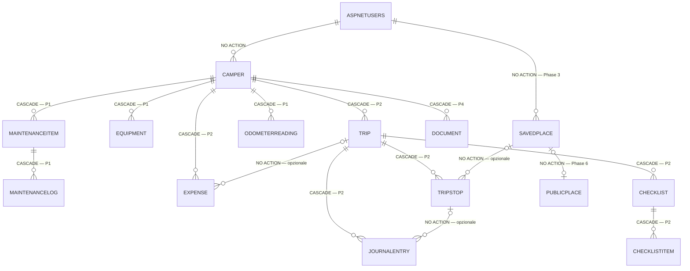
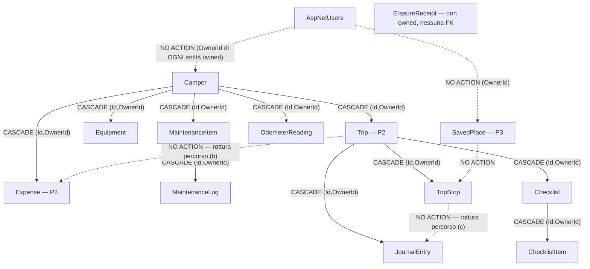

# Roamly — Domain Context e ubiquitous language

Stato: **modello deciso** · Ultimo aggiornamento: 2026-09-24 · Owner: @archimedes
Origine: `docs/archive/Roamly_Planning_2026-09-24.md` §6 Core Domain

> ✅ Il modello di dominio è **chiuso e approvato** (sessione di domain modeling del 2026-09-24).
> §2 è normativo per `OnModelCreating` e per la prima migration. §5 è normativo per la topologia delle foreign key.
> **Nessuna lacuna bloccante aperta.** §3.8 (chiave primaria) è chiusa da [`ADR-0008`](../adr/0008-primary-key-strategy.md); resta §3.11, che non è una decisione ma una **verifica da eseguire** — il test dello schema completo su SQL Server reale, prima attività tecnica del progetto.
> Nessuna slice di dominio va scritta contro un modello diverso da questo senza emendare prima il documento.

---

## 1. Struttura del dominio

```text
User
 │
 ├── Camper                                   ← Phase 1
 │    ├── Specifications (Dimensions/Weights/Capacities, inline)
 │    ├── Equipment                           ← Phase 1
 │    ├── MaintenanceItem ── MaintenanceLog   ← Phase 1
 │    ├── OdometerReading                     ← Phase 1
 │    ├── Document                            ← Phase 4
 │    ├── Expense                             ← Phase 2 (TripId opzionale)
 │    └── Trip                                ← Phase 2
 │         ├── TripStop  (→ SavedPlace, opzionale)
 │         ├── Checklist ── ChecklistItem
 │         └── JournalEntry (→ TripStop, opzionale)
 │
 └── SavedPlace                                ← Phase 3 (figlio diretto di User)

PublicPlace   ← Phase 6, non-owned, fuori dal grafo di ownership
ErasureReceipt ← non-owned, sopravvive all'utente
```

**Conseguenza architetturale fondamentale:** la radice del dominio è `User`. Ogni entità è raggiungibile solo passando da un utente, quindi **ogni query è owner-scoped**.

Questo non è più un'osservazione ma un **vincolo implementato**: ogni entità persistente porta `OwnerId` (denormalizzato anche sui figli) e implementa `IOwnedResource`. Vedi `SECURITY.md` §2 e [`ADR-0003`](../adr/0003-auth-and-ownership.md).

---

## 2. Entità

> **Legenda di fase.** 🟢 **Phase 1** = nella prima migration. 🟡 **Phase 2+** = topologia decisa ora, tabella creata dopo. ⚪ **Phase 6** = condizionata all'arrivo della community.
> La distinzione tra *decidere la topologia* e *creare la tabella* è deliberata: vedi §2.6.

### 2.0 Convenzioni valide per **ogni** entità owned

| Elemento | Forma | Origine |
|---|---|---|
| `Id` | `Guid` — parte della **PK composita `(OwnerId, Id)` CLUSTERED**, generato client-side, `ValueGeneratedNever()` | [`ADR-0008`](../adr/0008-primary-key-strategy.md) |
| `OwnerId` | `Guid` NOT NULL, FK → `AspNetUsers(Id)` **`ON DELETE NO ACTION`**, mai bindabile dal client, immutabile | [`ADR-0003`](../adr/0003-auth-and-ownership.md), [`ADR-0004`](../adr/0004-privacy-and-erasure.md) |
| `CreatedAtUtc` | `datetime2(3)` NOT NULL, sempre UTC | ADR-0004 |
| `UpdatedAtUtc` | `datetime2(3)` NULL — `NULL` significa "mai modificata dopo la creazione", ed è il segnale che spegne il badge "suggerita" (§2.2, `MaintenanceItem.Origin`) | questo documento |
| FK verso il padre | sempre **composita**: `(ParentId, OwnerId) → Parent(OwnerId, Id)` — referenzia **direttamente la PK** | R4, ADR-0008 |
| Indici | `OwnerId` è **sempre la prima colonna** | ADR-0003 |
| Query filter | filtro nominato `"OwnerScope"`, l'unico del sistema | R2 |

> ✅ **Un costo che ADR-0003 e ADR-0004 avevano dichiarato per eccesso, e che non esiste più.** Le FK composite richiedono che le colonne referenziate siano PK **oppure** alternate key sul principal. Finché la PK era `Id` da solo, serviva un `HasAlternateKey(e => new { e.Id, e.OwnerId })` — un indice `UNIQUE` aggiuntivo — su **ogni tabella-padre**. Con la **PK composita `(OwnerId, Id)`** di [`ADR-0008`](../adr/0008-primary-key-strategy.md) le FK referenziano direttamente la chiave primaria: **le sei chiavi alternate spariscono tutte**, insieme al loro costo di scrittura e di storage. La regola **R27** vieta che il requisito rientri per distrazione.

### 2.1 Value object — **complex type**, non owned type

`Money`, `Coordinates`, `Dimensions`, `Weights`, `Capacities` sono **complex type di EF Core 10**, non owned type. Stesse colonne sulla tabella padre, stessa migration — ma **non compaiono in `DbContext.Model.GetEntityTypes()`**, quindi non si presentano ai verificatori di R1/R8 come "entità owned prive di `OwnerId`" da whitelistare a mano.

> ADR-0001 diceva "owned type `Coordinates`". La scelta è stata **emendata formalmente**: vedi l'emendamento ad [`ADR-0001`](../adr/0001-use-sql-server.md).
> Costo: gli owned type sono entity type e hanno semantica di riferimento; i complex type hanno semantica di valore e supportano `ExecuteUpdate`. Il cambio è a costo zero **oggi** (nessuna tabella esiste) e diventa una migration di rinomina colonne dopo la prima migration.

| Value object | Colonne | Vincoli |
|---|---|---|
| **`Money`** | `Amount decimal(19,4)`, `Currency char(3)` | ISO 4217 maiuscolo, `CHECK (Currency = UPPER(Currency) AND LEN(Currency) = 3)`. 4 decimali (non 2) per reggere prezzi unitari (€1,879/l) e valute a 3 decimali. **Somma e sottrazione ammesse solo tra valute uguali: il tipo lancia altrimenti.** |
| **`Coordinates`** | `Latitude decimal(8,6)`, `Longitude decimal(9,6)` | WGS84. Invarianti: lat ∈ [-90, 90], lon ∈ [-180, 180]. Non è un tipo spaziale (ADR-0001) |
| **`Dimensions`** | `LengthMm`, `WidthMm`, `HeightMm` (`int`) | unità canonica: **millimetri interi** |
| **`Weights`** | `KerbWeightKg`, `MaxWeightKg` (`int`) | **kg interi** |
| **`Capacities`** | `FreshWaterL`, `GreyWaterL`, `FuelTankL`, `GasKg` (`int`) | **litri / kg interi** |

Un complex type **opzionale** (es. `Money?` su `MaintenanceLog`) è supportato da EF Core 10 a condizione che il tipo abbia almeno una proprietà required: `Money` e `Coordinates` la soddisfano.

**Multi-valuta: sì al dato, no alla conversione.** Ogni importo è persistito nella valuta in cui è stato speso. Nessun tasso di cambio, nessuna valuta di reporting calcolata: le aggregazioni sono **raggruppate per valuta**.

> ⚠️ **Costo dichiarato, non addolcito:** con più valute il mockup a *totale singolo* della dashboard costi non è realizzabile così com'è. Va risolto in UI, non convertendo in EUR alla scrittura — convertire alla scrittura **perde informazione in modo irreversibile** e rende i totali storici instabili rispetto al tasso usato.
> Il giorno in cui la conversione servirà, si aggiunge `ExchangeRate` **sulla riga** (tasso congelato al momento della spesa), non una tabella di tassi: un tasso ricalcolato a posteriori cambierebbe i consuntivi del passato.

### 2.2 Entità 🟢 **Phase 1** — nella prima migration

#### `User` (`IdentityUser<Guid>`) — radice di ownership, non owned di se stessa

Account e preferenze personali.

| Colonna | Tipo | Null | Semantica |
|---|---|---|---|
| `Id` | `Guid` | no | PK di Identity. **Fissa il tipo di `OwnerId` ovunque** |
| `DisplayName` | `nvarchar(80)` | sì | |
| `ReportingCurrency` | `char(3)` | no, default `EUR` | valuta preferita per la presentazione. **Non è una valuta di conversione**: non converte nulla (§2.1) |
| `CreatedAtUtc` | `datetime2(3)` | no | |

Campi aggiunti da [`ADR-0004`](../adr/0004-privacy-and-erasure.md):

| Colonna | Tipo | Semantica |
|---|---|---|
| `DeletionRequestedAtUtc` | `datetime2` NULL | quando l'utente ha chiesto la cancellazione. `NULL` = nessuna richiesta attiva |
| `DeletionScheduledForUtc` | `datetime2` NULL | `DeletionRequestedAtUtc + 30 giorni`. **Persistita, non calcolata**: se la grazia cambiasse, le richieste in corso devono mantenere la scadenza promessa. Indice filtrato `WHERE ... IS NOT NULL` |
| `PrivacyPolicyVersionSeen` | `nvarchar(32)` NULL | versione dell'informativa mostrata. **Non è un consenso** |

#### `ErasureReceipt` — **non owned**

Prova che una cancellazione è avvenuta. **Non implementa `IOwnedResource` e non ha FK verso `AspNetUsers`**: una ricevuta cancellata insieme all'utente sarebbe inutile. Entra nella whitelist esplicita di R1 e in quella di R10.

Campi: `Id`, `SubjectHash` (hash dell'identificativo, non l'identificativo), `RequestedAtUtc`, `ErasedAtUtc`, `SchemaVersion`, `DeletedRowCounts` (JSON diagnostico), `StorageSweepConfirmed`.

> ⚠️ `SubjectHash` è **pseudonimizzazione, non anonimizzazione**: chi conosce l'id di un utente può verificare se compare tra le ricevute. Accettato — l'alternativa è non poter dimostrare di aver cancellato.

#### `Camper` — owned, figlio diretto di `User`

Identità del mezzo. È la radice pratica del dominio: senza camper non esiste nulla di ciò che Roamly misura.

| Campo | Tipo | Null | Note |
|---|---|---|---|
| `Id`, `OwnerId`, `CreatedAtUtc`, `UpdatedAtUtc` | — | — | convenzioni §2.0 |
| `Name` | `nvarchar(60)` | no | nome dato dall'utente ("Il Grigio") |
| `Brand`, `Model` | `nvarchar(60)` | sì | |
| `Year` | `smallint` | sì | |
| `PlateNumber` | `nvarchar(16)` | sì | ⚠️ identificativo di un bene registrato: alza la sensibilità del dataset. Entra in export ed erasure come tutto il resto |
| `VehicleKind` | `tinyint` (`Motorhome/Van/Coachbuilt/Alcove/Caravan`) | no | |
| `Dimensions` | **complex type** (§2.1) | sì | |
| `Weights` | **complex type** (§2.1) | sì | |
| `Capacities` | **complex type** (§2.1) | sì | |
| `FuelKind` | `tinyint` | sì | |
| `AverageConsumptionLPer100Km` | `decimal(4,1)` | sì | dato dichiarato, non calcolato |
| `RowVersion` | `rowversion` | no | concorrenza ottimistica; mappatura a ETag → @hermes |

PK: `(OwnerId, Id)` CLUSTERED — è padre di 6 entità e la sua PK basta a tutte le FK composite. Nessun indice `(OwnerId)` separato: la clustering key lo contiene già come colonna guida.

> **Niente tabella `CamperSpecification` 1:1.** Tre complex type sulla stessa tabella danno gli stessi campi senza una join, senza una FK e senza una riga che può mancare.
> Costo: estrarli in una tabella separata più avanti è una migration con copia dati — rara, ma non gratis.

> Un `Camper` valido ha ~15 campi: serve una convenzione di **test data builder** (vedi `TESTING.md`).

#### `Equipment` — owned, figlio di `Camper`, **CASCADE**

Oggetti e accessori presenti sul camper: pannelli solari, batteria, inverter, bombole, portabici, tendalino, livellatori.

`Id`, `OwnerId`, `CamperId`, `Name nvarchar(60)` NOT NULL, `Category tinyint`, `Notes nvarchar(500)?`, `InstalledOnUtc date?`, `CreatedAtUtc`.
FK: `(CamperId, OwnerId) → Camper(Id, OwnerId)` **CASCADE**. Indice `(OwnerId, CamperId)`.

#### `MaintenanceItem` — owned, figlio di `Camper`, **CASCADE**

È la **regola** di una manutenzione ricorrente **più lo stato di scadenza denormalizzato**.

| Campo | Tipo | Null | Note |
|---|---|---|---|
| `Id`, `OwnerId`, `CamperId`, `CreatedAtUtc`, `UpdatedAtUtc` | — | — | |
| `Name` | `nvarchar(80)` | no | "Cambio olio" |
| `Category` | `tinyint` | no | |
| `IntervalKm` | `int` | sì | ≥ 1 |
| `IntervalMonths` | `smallint` | sì | ≥ 1 |
| `LastServiceOnUtc` | `date` | sì | denormalizzato dall'ultimo `MaintenanceLog` |
| `LastServiceOdometerKm` | `int` | sì | idem |
| `NextDueOnUtc` | `date` | sì | **persistito**, calcolato dal dominio |
| `NextDueOdometerKm` | `int` | sì | **persistito**, calcolato dal dominio |
| `Origin` | `tinyint` (`User=0`, `Seed=1`) | no | provenienza, **immutabile** |
| `SeedTemplateKey` | `nvarchar(64)` | sì | quale voce di catalogo ha generato la riga |
| `SeedCatalogVersion` | `nvarchar(32)` | sì | quale versione del catalogo |
| `IsActive` | `bit` | no, default 1 | disattivare ≠ cancellare |
| `RowVersion` | `rowversion` | no | |

Constraint:
- `CHECK (IntervalKm IS NOT NULL OR IntervalMonths IS NOT NULL)` — una manutenzione senza ricorrenza non è un `MaintenanceItem`, è una voce di storico;
- `CHECK ((Origin = 1 AND SeedTemplateKey IS NOT NULL) OR (Origin = 0 AND SeedTemplateKey IS NULL))`.

Indici: `(OwnerId, CamperId)`, `(OwnerId, NextDueOnUtc) WHERE IsActive = 1`.
PK: `(OwnerId, Id)` CLUSTERED — referenziata dalla FK composita di `MaintenanceLog`.

**Regola di ricorrenza** (una manutenzione può scadere per km *e* per tempo, e scatta al primo dei due). Alla registrazione di un `MaintenanceLog`:

```
LastServiceOnUtc      = log.PerformedOnUtc
LastServiceOdometerKm = log.OdometerKm                          (se presente)
NextDueOnUtc          = LastServiceOnUtc + IntervalMonths       se IntervalMonths != null
NextDueOdometerKm     = LastServiceOdometerKm + IntervalKm      se IntervalKm != null e km noti
```

Un item **senza storico** ha `LastService*` a `NULL`, non produce reminder e mostra lo stato "mai eseguito". **Non si inventa una data di partenza.**

**`bindingAxis` e `severity` (`Ok | DueSoon | Overdue`) sono calcolati dal server**, mai dal client: due implementazioni della stessa regola divergono sempre, e il reminder job risponderebbe diversamente dalla UI.

> ⚠️ **Costo del denormalizzato**: `NextDue*` possono divergere se qualcuno scrive fuori dal metodo di dominio. Il database non protegge da questo: lo protegge un test di ricalcolo (@argus).
> ⚠️ **Il reminder per km non scatta da solo.** Un camper che percorre 20.000 km senza che l'utente registri una lettura non produce alcun avviso km — conseguenza inevitabile del non voler stimare (R25).

**Provenienza da seed (R24).** `Origin` è un **fatto storico e non si riscrive**: se l'utente modifica una voce suggerita, `Origin` resta `Seed`, ma il **badge "suggerita" si spegne alla prima modifica**, tracciata da `UpdatedAtUtc IS NOT NULL`. Così l'eliminazione in blocco (`… WHERE Origin = 1`) resta possibile — con l'obbligo di avvisare l'utente di quante voci *modificate* porterebbe via.

Il **catalogo dei seed** vive come **risorsa versionata nel codice** (JSON embedded + test di schema), **non come tabella**: una tabella di catalogo sarebbe una nuova entità non-owned da giustificare in whitelist R1/R10, per un dato che non cambia a runtime e che deve essere diffabile in git.

#### `MaintenanceLog` — owned, figlio di `MaintenanceItem`, **CASCADE**

Il **fatto** che un intervento è stato eseguito. Immutabile.

`Id`, `OwnerId`, `MaintenanceItemId`, `PerformedOnUtc date` NOT NULL, `OdometerKm int?`, `Cost` (**complex type `Money`, nullable**), `Workshop nvarchar(80)?`, `Notes nvarchar(1000)?`, `CreatedAtUtc`.
FK: `(MaintenanceItemId, OwnerId) → MaintenanceItem(Id, OwnerId)` **CASCADE**. Indice `(OwnerId, MaintenanceItemId, PerformedOnUtc DESC)`.

> **Il costo dell'intervento vive qui, non in `Expense`.** Di conseguenza **la categoria `Maintenance` non esiste** tra le categorie di `Expense`: evita il doppio inserimento e il doppio conteggio. Il Cost Management legge da **entrambe** le fonti e le somma per valuta.

Ogni `MaintenanceLog` con `OdometerKm` valorizzato **genera automaticamente** un `OdometerReading` con `Source = Service`.

#### `OdometerReading` — owned, figlio di `Camper`, **CASCADE**

Una lettura **datata** del contachilometri. È il prerequisito dell'asse km del `Ribbon`, ma non nasce per lui: i widget "km annuali" e "€/km" la richiedono comunque.

`Id`, `OwnerId`, `CamperId`, `ReadingKm int` NOT NULL, `TakenOnUtc date` NOT NULL, `Source tinyint` (`Manual=0`, `Service=1`, `TripEnd=2` da Phase 2), `CreatedAtUtc`.
FK: `(CamperId, OwnerId) → Camper(Id, OwnerId)` **CASCADE**.
Indice `(OwnerId, CamperId, TakenOnUtc DESC)` — è insieme la query "lettura corrente" e quella dei km annuali.
`UNIQUE (OwnerId, CamperId, TakenOnUtc)`: **una lettura al giorno per camper**.

> ⚠️ Il vincolo unique è una semplificazione arbitraria: correggere una lettura appena inserita significa aggiornarla, non inserirne un'altra. Reversibile, ma è un limite scelto, non derivato.
> ⚠️ Una lettura **senza data mente**: "94.120 km" inseriti a marzo sembrerebbero di oggi. Per questo non esiste un campo `CurrentOdometerKm` su `Camper`.
> **Nessuna estrapolazione.** Se la lettura più recente è vecchia, il server la espone com'è (con la sua data) e la marca `stale` oltre i 90 giorni. Se non esiste alcuna lettura, il `Ribbon` degrada sul solo asse temporale (R25). La qualifica del dato è lecita; la stima no.

### 2.3 Entità 🟡 **Phase 2+** — topologia decisa ora, tabella creata dopo

> Queste entità **non entrano nella prima migration** (§2.6). Ciò che va fissato adesso è la *topologia*: cambiare una FK composita dopo significa riscrivere lo schema.

#### `Expense` — owned, figlio di `Camper` (**obbligatorio**) e di `Trip` (**opzionale**) — Phase 2

Un esborso. **`CamperId` è obbligatorio, `TripId` è opzionale.**

Argomento: la metrica portante del prodotto è il **costo reale del camper** (totale, per km, per giorno, per viaggio). Una spesa non attribuibile a un camper non entra in nessuna di quelle metriche: è una riga che esiste per non rispondere a niente. E poiché `Trip` è figlio obbligatorio di `Camper`, una spesa di viaggio ha **sempre** un camper: `CamperId` non è una forzatura, è una verità del dominio resa esplicita.

| Campo | Tipo | Null | Note |
|---|---|---|---|
| `Id`, `OwnerId`, `CreatedAtUtc` | — | — | |
| `CamperId` | — | **no** | FK composita **CASCADE** |
| `TripId` | — | sì | FK composita **NO ACTION** |
| `Amount` | complex type `Money` | no | |
| `Category` | `tinyint` | no | `Fuel/Toll/Campsite/Insurance/Gas/Parking/Other` — **senza `Maintenance`** (vive su `MaintenanceLog`) |
| `IncurredOnUtc` | `date` | no | |
| `Description` | `nvarchar(200)` | sì | |
| `OdometerKm` | `int` | sì | serve al €/km |

Indici: `(OwnerId, CamperId, IncurredOnUtc)`, `(OwnerId, TripId) WHERE TripId IS NOT NULL`.

Conseguenze della scelta:
- **una sola cascade path** (`Camper → Expense`); `Trip → Expense` è `NO ACTION`;
- **nessun `CHECK` polimorfo** "esattamente uno valorizzato" e nessun polimorfismo da interpretare in ogni query;
- il Cost Management è `WHERE OwnerId = @me AND CamperId = @c`, con `TripId` come dimensione facoltativa. Nessuna `UNION`;
- cancellare un `Trip` **non cancella le spese**: le sgancia (`TripId = NULL`), perché i soldi sono stati spesi comunque.

> ⚠️ Lo sganciamento è **codice applicativo** nell'handler `DeleteTrip`, non un vincolo di database: `ON DELETE SET NULL` è **vietato** (§5.2). Quindi è dimenticabile, e va coperto da test.
> ⚠️ **Tradeoff accettato**: non si può registrare una spesa senza camper (la spesa fatta prima di possedere il mezzo, o l'assicurazione di un camper venduto). Chi non ha un camper non usa Roamly.

#### `Trip` — owned, figlio di `Camper` (**obbligatorio**), **CASCADE** — Phase 2

Un viaggio, dalla pianificazione al consuntivo. `CamperId` obbligatorio è conseguenza diretta del grafo di cancellazione e del principio "camper-first".

Campi: `Id`, `OwnerId`, `CamperId`, `Name`, `Status tinyint`, `PlannedStartOnUtc?`, `PlannedEndOnUtc?`, `ActualStartOnUtc?`, `ActualEndOnUtc?`, `CreatedAtUtc`, `UpdatedAtUtc`, `RowVersion`.
PK: `(OwnerId, Id)` CLUSTERED — referenziata dalle FK composite di `TripStop`, `Checklist`, `JournalEntry`, `Expense`.

**Stati: enum a 4 valori** — `Planned`, `Active`, `Completed`, `Cancelled`.

```
           ┌────────────┐
           │  Planned   │──────────────┐
           └─────┬──────┘              │
                 │ start               │ cancel
                 ▼                     ▼
           ┌────────────┐        ┌───────────┐
           │   Active   │───────▶│ Cancelled │
           └─────┬──────┘ cancel └───────────┘
                 │ complete
                 ▼
           ┌────────────┐
           │ Completed  │   (riapribile solo → Active, atto esplicito)
           └────────────┘
```

| Da → A | `Planned` | `Active` | `Completed` | `Cancelled` |
|---|---|---|---|---|
| **`Planned`** | — | ✅ start | ❌ | ✅ cancel |
| **`Active`** | ❌ | — | ✅ complete | ✅ cancel |
| **`Completed`** | ❌ | ✅ riapertura | — | ❌ |
| **`Cancelled`** | ❌ | ❌ | ❌ | — |

Invarianti: `Active` richiede `ActualStartOnUtc`; `Completed` richiede `ActualEndOnUtc`; un `Cancelled` non accetta nuove spese né nuove tappe.

Implementazione: `enum byte` + metodo di dominio `Trip.TransitionTo(status)` con `switch` sulle coppie legali + **test parametrico sulla matrice 4×4**. **Nessuna libreria di state machine**: per un grafo con 5 archi aggiungerebbe un vocabolario, una dipendenza e un punto di configurazione senza restituire nulla.

> ⚠️ Gli stati **non vanno derivati dalle date** ("è in corso se oggi è tra start ed end"). Uno stato derivato cambia da solo mentre l'utente non guarda, e il journal e le metriche di prodotto hanno bisogno di un **atto** esplicito da tracciare (`TripCompleted`).

#### `TripStop` — owned, figlio di `Trip`, **CASCADE** — Phase 2

Una **tappa di un viaggio specifico**, con posizione e momento propri. Appartiene a un solo viaggio: non è un luogo riusabile.

Campi: `Id`, `OwnerId`, `TripId`, `SequenceNo int`, `Name nvarchar(80)`, `Position` (complex type `Coordinates`, **nullable** — una tappa senza posizione ha senso: "da qualche parte in Bretagna"), `ArrivalOnUtc?`, `DepartureOnUtc?`, `SavedPlaceId?`, `Notes?`, `CreatedAtUtc`.
FK: `(TripId, OwnerId) → Trip` **CASCADE**; `(SavedPlaceId, OwnerId) → SavedPlace` **NO ACTION**.
PK: `(OwnerId, Id)` CLUSTERED — referenziata dalla FK composita opzionale di `JournalEntry`.

La posizione è uno **snapshot**: se il `SavedPlace` collegato cambia o sparisce, la tappa resta leggibile.

#### `SavedPlace` — owned, figlio **diretto di `User`**, `NO ACTION` — Phase 3

> **`Place` non esiste più come entità unica.** Era ambiguo perché erano **due cose diverse chiamate con lo stesso nome**:
> il *fatto geografico* ("il campeggio X è a queste coordinate") non è un dato personale; **il fatto che io l'abbia salvato, valutato o visitato lo è** — ed è esattamente ciò che l'utente si aspetta sparisca alla cancellazione.

`SavedPlace` è il **luogo salvato dall'utente**, riusabile tra più viaggi: owned a tutti gli effetti, dentro `IOwnedResource`, dentro l'export e dentro il grafo di cancellazione.

Campi: `Id`, `OwnerId`, `Name nvarchar(120)`, `Category tinyint` (area sosta, campeggio, parcheggio, punto panoramico, ristorante, distributore, officina, supermercato, POI), `Position` (complex `Coordinates`, nullable), `Address nvarchar(300)?`, `Notes?`, `CreatedAtUtc`, `UpdatedAtUtc`, più **tre colonne di provenienza esterna senza FK**: `ExternalProvider nvarchar(32)?`, `ExternalPlaceId nvarchar(128)?`, `ExternalFetchedAtUtc?`.
FK: `OwnerId → AspNetUsers` **NO ACTION**. PK: `(OwnerId, Id)` CLUSTERED — referenziata dalla FK composita opzionale di `TripStop`.

I dati del luogo sono uno **snapshot**: il sistema resta leggibile anche se il provider esterno non risponde, e la provenienza persistita è il prerequisito per distinguere dato verificato / stima / contenuto utente.

> ⚠️ Uno snapshot invecchia: un campeggio che chiude resta nel `SavedPlace` dell'utente. Accettato — l'alternativa richiede una dipendenza viva dal provider.
> ⚠️ La **deduplicazione non esiste**: dieci utenti che salvano lo stesso campeggio producono dieci righe. È il debito consapevole che `PublicPlace` salderà in Phase 6.

#### `PublicPlace` — ⚪ **non owned**, Phase 6, condizionata

Il **fatto geografico condiviso** tra utenti, soggetto su cui aggregare rating e recensioni della community. Nasce **non-owned** e in **whitelist R1/R10, con motivazione scritta allora**, con il vincolo che **non contenga riferimenti diretti a utenti**: i rating saranno un'entità owned separata, non colonne su `PublicPlace`.

L'innesto è **additivo**: `SavedPlace` acquisirà una FK opzionale `NO ACTION` verso `PublicPlace`. Nessun dato personale si sposta in una tabella condivisa, nessuna FK esistente viene riscritta.

#### `Checklist` — owned, figlio di `Trip`, **CASCADE** — Phase 2

Lista di controllo legata a un viaggio **e a un momento**: `Kind` (`Departure` / `Arrival` / `Storage`).
Campi: `Id`, `OwnerId`, `TripId`, `Name`, `Kind tinyint`, `Origin`/`SeedTemplateKey`/`SeedCatalogVersion` (stessa semantica di `MaintenanceItem`), `CreatedAtUtc`, `UpdatedAtUtc`.
PK: `(OwnerId, Id)` CLUSTERED — referenziata dalla FK composita di `ChecklistItem`.

#### `ChecklistItem` — owned, figlio di `Checklist`, **CASCADE** — Phase 2

`Id`, `OwnerId`, `ChecklistId`, `Text nvarchar(200)`, `IsDone bit`, `SortOrder int`, `CreatedAtUtc`.
Catena a 3 livelli (`Trip → Checklist → ChecklistItem`): un solo percorso per ogni coppia, quindi legale (§5).

#### `JournalEntry` — owned, figlio di `Trip`, **CASCADE** — Phase 2

Una nota o un ricordo del viaggio, **opzionalmente ancorata a una tappa**.
Campi: `Id`, `OwnerId`, `TripId`, `TripStopId?`, `EntryOnUtc date`, `Title nvarchar(120)?`, `Body nvarchar(max)`, `CreatedAtUtc`, `UpdatedAtUtc`.
FK: `(TripId, OwnerId) → Trip` **CASCADE**; `(TripStopId, OwnerId) → TripStop` **NO ACTION**.

> 🔴 **La seconda FK è `NO ACTION` per obbligo, non per stile.** `Trip → JournalEntry` diretto e `Trip → TripStop → JournalEntry` sono due percorsi verso la stessa tabella: se entrambi fossero in cascade, la migration fallirebbe con l'errore **1785**. Vedi §5.2 caso (c).

#### `Document` — owned, figlio di `Camper`, **CASCADE** — 🟡 Phase 4

Documenti relativi al camper e al viaggio (libretto, assicurazione, revisione, ricevute). **Fuori dall'MVP per decisione esplicita**: introduce lo storage di file, che è un sottosistema a sé (e un secondo grafo di cancellazione, quello degli oggetti binari).
Topologia prevista: `(CamperId, OwnerId) → Camper` **CASCADE**, più una FK opzionale `NO ACTION` verso `Trip` se servirà. La sua introduzione richiede di **rileggere §5 prima di scrivere la migration**.

### 2.4 Diagramma del modello



Lo stesso grafo, letto come **azioni referenziali** (è la vista che conta per §5):



### 2.5 Perimetro di export e di cancellazione

| Categoria | Entità |
|---|---|
| **Owned** (R1, export e erasure R8/R9) | 🟢 `Camper`, `Equipment`, `MaintenanceItem`, `MaintenanceLog`, `OdometerReading` · 🟡 `Trip`, `TripStop`, `Checklist`, `ChecklistItem`, `JournalEntry`, `Expense`, `Document` · 🟡 `SavedPlace` |
| **Non owned, whitelist R1/R10** | `ErasureReceipt` (motivazione in ADR-0004) · ⚪ `PublicPlace` (motivazione da scrivere in Phase 6) |
| **Non entità** | `Money`, `Coordinates`, `Dimensions`, `Weights`, `Capacities` → complex type, colonne del padre, esportate col contenitore |
| **Fuori da entrambi i grafi per costruzione** | catalogo dei seed (risorsa di codice, non tabella) |

**Ordine di cancellazione derivato dal modello:** `MaintenanceLog` → `MaintenanceItem` → `OdometerReading` → `Equipment` → `ChecklistItem` → `Checklist` → `JournalEntry` → `Expense` → `TripStop` → `Trip` → `Document` → `SavedPlace` → `Camper` → utente.
Le CASCADE farebbero gran parte del lavoro da sole; **il job non deve dipendere da questo**: deve derivare l'ordine dal modello e verificare `COUNT(*) = 0` (R9).

### 2.6 Perimetro della prima migration

**La prima migration crea solo le tabelle 🟢 Phase 1** (`Camper`, `Equipment`, `MaintenanceItem`, `MaintenanceLog`, `OdometerReading`, `ErasureReceipt`, più le colonne ADR-0004 su Identity). Le entità 🟡 hanno **topologia decisa e documentata qui, ma nessuna tabella**: tabelle vuote in produzione per sei mesi sono debito, non preparazione.

**Insieme però va scritto subito un test "schema completo"**: costruisce l'**intero** modello (Phase 1 + Phase 2/3) su un **SQL Server reale in container** e verifica che lo schema si crei. Serve a far emergere **il primo giorno** i due casi 1785 di §5.2, in un momento in cui costano un'ora invece di una settimana. Questo test non produce migration in repo.

> ⚠️ Senza questo test, §5 resta una dimostrazione **analitica**: l'errore 1785 **non emerge in `migrations add`**, emerge all'esecuzione.

> Lo stesso test copre un secondo fallimento della medesima natura: **R33** ([`ADR-0008`](../adr/0008-primary-key-strategy.md)) richiede che EF Core generi le colonne della clausola `REFERENCES` nell'ordine corretto delle FK composite. Un ordine invertito produce uno schema **sintatticamente valido ma semanticamente sbagliato**, che nessuna analisi del modello intercetta — si vede solo a schema creato.

---

## 3. Lacune bloccanti da chiudere

Queste non sono rifiniture: da ognuna dipendono tabelle, API e feature.
Le lacune **chiuse** restano qui con la decisione presa e il motivo — non vengono cancellate: chi legge deve poter ricostruire *cosa* è stato deciso e *perché*, senza rileggere la discussione.

| # | Lacuna | Stato |
|---|---|---|
| 3.1 | Stati di `Trip` | ✅ chiusa |
| 3.2 | Semantica di `Place` | ✅ chiusa |
| 3.3 | Appartenenza di `Expense` | ✅ chiusa |
| 3.4 | `Money` e multi-valuta | ✅ chiusa |
| 3.5 | Unità di misura | ✅ chiusa |
| 3.6 | Ricorrenza di `MaintenanceItem` | ✅ chiusa |
| 3.7 | `Coordinates` | ✅ chiusa (con emendamento ad ADR-0001) |
| 3.8 | **Tipo della chiave primaria** | 🔴 **aperta — bloccante — @oracle** |
| 3.9 | Lettura del contachilometri | ✅ chiusa |
| 3.10 | Origine dei dati da seed | ✅ chiusa |
| 3.11 | Verifica 1785 su SQL Server reale | ⚠️ aperta — @argus |

### 3.1 Stati di `Trip` — ✅ **chiusa**

**Decisione: `enum` a 4 stati** (`Planned`, `Active`, `Completed`, `Cancelled`) con **matrice di transizioni esplicita**, guardata da un metodo di dominio `Trip.TransitionTo(...)` e coperta da un **test parametrico 4×4**. Definizione normativa in §2.3.

*Perché così:* gli stati erano impliciti e metà delle feature (dashboard, journal, metriche) ne dipende. **Scartato** derivare lo stato dalle date: uno stato derivato cambia da solo mentre l'utente non guarda e rende `TripCompleted` non tracciabile come atto. **Scartata** una libreria di state machine: 5 archi non giustificano una dipendenza e un vocabolario in più.

*Costo:* `Cancelled` è uno stato terminale che resta a carico di ogni query di lista; la riapertura `Completed → Active` esiste solo per correggere errori umani e va resa esplicita in UI.

### 3.2 Semantica di `Place` — ✅ **chiusa**

**Decisione: `Place` si separa in due entità.** `SavedPlace` (**owned**, dentro `IOwnedResource`, export ed erasure) da subito come semantica — tabella in **Phase 3**; `PublicPlace` (**non-owned**, whitelist R1/R10) **solo in Phase 6**, e solo se la community arriva. Definizioni in §2.3.

*Perché così:* la domanda "POI condiviso o luogo dell'utente?" non aveva risposta perché **erano due entità diverse chiamate con lo stesso nome**. Il fatto geografico non è un dato personale; il fatto che io l'abbia salvato lo è. Separarle tiene R1/R8/R9 intatte oggi e rende l'innesto della Phase 6 **additivo** (una colonna nullable e una FK `NO ACTION`), invece di una migrazione di dati personali dentro una tabella condivisa.

*Scartate:* `Place` globale non-owned da subito — violerebbe R1 dal primo giorno mettendo in whitelist una tabella che nell'MVP contiene *solo* dati inseriti da utenti, cioè dati personali fuori da export ed erasure. E `Place` owned unico per sempre — paga tutto il debito in Phase 6.

*Costo dichiarato:* nessuna deduplicazione nell'MVP (dieci utenti, dieci righe), tre colonne di provenienza inutilizzate fino alla Phase 6, e uno snapshot che invecchia.

> **Vincolo ADR-0004 soddisfatto:** `SavedPlace` **resta nel grafo di cancellazione**. `PublicPlace` ne uscirà con motivazione scritta e con il divieto di contenere riferimenti diretti a utenti.
> **Nessuna delle due tabelle entra nella prima migration** (§2.6): decidere la semantica non significa creare la tabella.

### 3.3 Appartenenza di `Expense` — ✅ **chiusa**

**Decisione: `CamperId` obbligatorio + `TripId` opzionale.** Nessun polimorfismo, nessun `CHECK` "esattamente uno", una sola cascade path. Definizione in §2.3.

*Perché così:* la metrica portante del prodotto è il costo reale **del camper**. Una spesa senza camper non entra in nessuna metrica. E poiché `Trip` è figlio obbligatorio di `Camper`, una spesa di viaggio ha sempre un camper: `CamperId` obbligatorio non è una forzatura, è una verità del dominio resa esplicita.

*Scartate:* due FK nullable + `CHECK` (polimorfismo da interpretare in ogni query, due `NO ACTION` obbligatorie, `AccountErasureJob` con un passo in più); due tabelle per contesto (`CamperExpense`/`TripExpense`) — cascade più semplici, ma il Cost Management diventa una `UNION` permanente.

*Conseguenze:*
- `Camper → Expense` **CASCADE**, `Trip → Expense` **NO ACTION**: un solo percorso, 1785 evitato (§5.2 caso b);
- cancellare un `Trip` **non cancella le spese**, le **sgancia** (`TripId = NULL`) — i soldi sono stati spesi comunque. Miglioramento rispetto a entrambe le opzioni originali;
- ⚠️ lo sganciamento è **codice applicativo**, non un constraint: `ON DELETE SET NULL` è vietato (§5.2). È dimenticabile, quindi va testato.

*Costo dichiarato:* non si può registrare una spesa senza camper.

> I vincoli di [`ADR-0003`](../adr/0003-auth-and-ownership.md) restano validi e sono applicati: `Expense` porta `OwnerId` proprio, entrambe le FK sono **composite** verso `(Id, OwnerId)`.
> Il `CHECK` "esattamente uno valorizzato" previsto da ADR-0003 **decade**, perché decade il polimorfismo.

### 3.4 `Money` e multi-valuta — ✅ **chiusa**

**Decisione: `Money` come complex type multi-valuta (`Amount decimal(19,4)` + `Currency char(3)`), senza conversione.** Aggregazioni raggruppate per valuta. Definizione in §2.1.

*Perché così:* il multi-valuta è reale per chi viaggia in camper, e **la valuta del passato non è ricostruibile**: partire a valuta singola è l'unica scelta irreversibile del gruppo. Tassi di cambio e valuta di reporting sono invece struttura senza caso d'uso, aggiungibili dopo (`ExchangeRate` **sulla riga**, congelato al momento della spesa — mai una tabella di tassi ricalcolabile, che cambierebbe i consuntivi del passato).

*Costo dichiarato, da girare a @pixel:* con più valute **la dashboard costi a totale singolo non è realizzabile così com'è**. Chi ha una sola valuta — il caso reale quasi sempre — non vede differenza.

### 3.5 Unità di misura — ✅ **chiusa**

**Unità canoniche di persistenza**, conversione solo al bordo (presentazione/input):

| Grandezza | Unità persistita | Tipo |
|---|---|---|
| Distanza / contachilometri | **km interi** | `int` |
| Dimensioni del veicolo | **mm interi** | `int` (complex `Dimensions`) |
| Pesi | **kg interi** | `int` (complex `Weights`) |
| Volumi (acqua, carburante) | **litri interi** | `int` (complex `Capacities`) |
| Gas | **kg interi** | `int` |
| Consumo | **L/100 km** | `decimal(4,1)` |
| Denaro | valuta d'origine + ISO 4217 | complex `Money` |
| Posizione | **gradi decimali WGS84** | complex `Coordinates` |
| Istanti | **UTC** sempre (`…Utc` nel nome) | `datetime2(3)` / `date` |

*Perché millimetri e non metri:* le dimensioni di un camper si confrontano con limiti di altezza e larghezza dichiarati al centimetro; un intero in mm evita sia il floating point sia gli arrotondamenti al bordo.

### 3.6 Ricorrenza di `MaintenanceItem` — ✅ **chiusa**

**Decisione: regola persistita (`IntervalKm?` / `IntervalMonths?`, almeno uno) + stato di scadenza denormalizzato (`NextDueOnUtc`, `NextDueOdometerKm`)** ricalcolato dal dominio a ogni `MaintenanceLog`. `bindingAxis` e `severity` **calcolati dal server**. Definizione e formule in §2.2.

*Perché denormalizzare:* il widget "prossime manutenzioni" e il reminder job **ordinano per scadenza**. Ricalcolarla in query significa una sottoquery sull'ultimo log per ogni item, oppure un calcolo in memoria su tutti gli item.

*Costo dichiarato:* due colonne che possono divergere. L'unica via di scrittura è un metodo di dominio; la garanzia è un test di ricalcolo, **non** il database.

> Nota da [`ADR-0003`](../adr/0003-auth-and-ownership.md): il reminder job gira fuori da HTTP, con `RunAsUser(userId, "maintenance reminder")` (ADR-0004), e interroga `(OwnerId, NextDueOnUtc) WHERE IsActive = 1`.
> ⚠️ **L'asse km non è interrogabile da un job temporale:** il reminder per km scatta quando l'utente **registra una lettura**, non quando passa il tempo. Un camper fermo non genera reminder km — ed è corretto così.

### 3.7 `Coordinates` — ✅ **chiusa (con emendamento ad ADR-0001)**

**Decisione: `Coordinates` è un complex type** (non un owned type): `Latitude decimal(8,6)`, `Longitude decimal(9,6)`, WGS84, **nullable** — un luogo o una tappa senza posizione ha senso ed è un caso reale.
**Invarianti di range**: lat ∈ [-90, 90], lon ∈ [-180, 180], validate nel value object.

*Perché il cambio:* gli owned type **sono entity type** e compaiono in `DbContext.Model.GetEntityTypes()`, dove i verificatori di R1/R8 li vedrebbero come entità owned prive di `OwnerId` — falsi positivi da whitelistare a mano, cioè esattamente la dipendenza dalla memoria che R8 vuole eliminare. I complex type hanno semantica di valore, generano **le stesse colonne** e supportano `ExecuteUpdate`.

> La forma "owned type" di [`ADR-0001`](../adr/0001-use-sql-server.md) è **formalmente emendata**. L'emendamento vale per tutti i value object del modello (§2.1), non solo per `Coordinates`.

### 3.8 Chiave primaria — ✅ **chiusa**

> ✅ **CHIUSA il 2026-09-25 (@oracle)** → [`ADR-0008`](../adr/0008-primary-key-strategy.md). **PK composita `(OwnerId, Id)` CLUSTERED**, `Id` `Guid` generato **client-side** da `IIdGenerator` (COMB), `ValueGeneratedNever()`.

**La domanda posta qui era quella sbagliata.** §3.8 chiedeva *quale tipo* dare alla PK; la domanda che contava era *quale forma*. Il sistema è **owner-scoped per costruzione**: ogni query filtra per `OwnerId`, ogni FK lo trasporta. Mettere `OwnerId` nella chiave clusterizzata allinea fisicamente le righe di uno stesso utente, e il `DELETE` ordinato dell'erasure diventa un **range seek locale** invece che sparso.

| Esito | Conseguenza |
|---|---|
| PK `(OwnerId, Id)` CLUSTERED | le FK composite referenziano **direttamente la PK** |
| **Le 6 chiavi alternate `UNIQUE (Id, OwnerId)` spariscono** | il costo che §5.3 quantificava **non esiste più** — vedi §2.0 |
| `CreatedAtUtc` **fuori** dalla clustering key | le query reali ordinano per `ReadAtUtc`, `SpentOn`, `NextDueAtUtc`, non per data di creazione |
| Nessuna unicità globale di `Id` garantita | l'unicità è per owner; quella probabilistica del `Guid` basta al resto |

> ❌ **`Guid.CreateVersion7()` non è sequenziale negli indici SQL Server — ma la causa scritta qui in precedenza era sbagliata.**
> La versione precedente attribuiva il problema al **layout di byte di `System.Guid`**, lasciando intendere che una futura versione di .NET potesse risolverlo. **Non è così.** SQL Server confronta gli `uniqueidentifier` in **cinque gruppi**, trattando i **byte 10-15 come il criterio più significativo**; l'RFC 9562 colloca il timestamp della v7 nei **primi 6 byte**, cioè esattamente dove SQL Server guarda **per ultimo**. La causa è l'**ordinamento di confronto del tipo di colonna**, non il linguaggio: **nessuna versione futura di .NET lo risolverà.**
> Il `SequentialGuidValueGenerator` di EF Core scrive proprio nei byte 10-15: fa l'opposto della v7, ed è corretto.
> ❌ **`NEWSEQUENTIALID()` è comunque respinto**: non restituisce l'`Id` prima dell'`INSERT`, è incompatibile con una PK composita generata dall'applicazione e Microsoft stessa ne sconsiglia l'uso dove i valori non devono essere indovinabili.

> Sull'**enumerazione**: resta l'argomento **più debole** a favore del `Guid`. Il più forte è un altro — un `int 42` è un identificatore plausibile in *qualunque* tabella del sistema, mentre un `Guid` preso dal contesto sbagliato muore in un 404 senza mai sfiorare dati altrui.

### 3.9 Lettura corrente del contachilometri — ✅ **chiusa**

> ✅ **CHIUSA. Decisione: entità `OdometerReading` datata** (§2.2), alimentata **anche automaticamente** da ogni `MaintenanceLog` con `OdometerKm`.

Il `Ribbon` mostra quanto manca alla prossima manutenzione lungo **due assi: tempo e chilometri**. L'asse temporale si calcola da solo; l'asse km richiede di sapere a quanti chilometri è il camper **adesso**.

*Perché un'entità e non un campo:* l'argomento decisivo **non è il `Ribbon`**. I widget "km annuali" e il "€/km" del Cost Management richiedono *comunque* letture **datate**: un campo `CurrentOdometerKm` su `Camper` non è più economico, è solo posticipato — e **senza data il dato mente**. Con l'entità, lo scenario "conosco solo i km all'ultimo intervento" diventa un **caso particolare** del modello (tutte le letture con `Source = Service`), non un modello alternativo.

*Scartato:* il fallback puro R25 (nessuna lettura, solo asse temporale) — svuoterebbe di metà contenuto il componente identitario dell'MVP.

**Dove vive il calcolo: nel server**, in un read model dedicato che espone `from`, `to`, `current` (con `asOfUtc` obbligatorio), `bindingAxis`, `kmRemaining`, `daysRemaining`, `severity` **già risolti**. Il React riceve numeri e li disegna.
- `current` **assente** se non esiste alcuna lettura → il componente degrada all'asse temporale senza alcuna logica di dominio nel client;
- **nessuna estrapolazione** (R25): se `asOfUtc` è più vecchia di **90 giorni**, il server marca `currentStale: true`. È una qualifica del dato, non una stima.

*Costo dichiarato:* l'utente deve compiere un gesto in più. La mitigazione (lettura automatica dal log di manutenzione) copre lo scenario minimo ma **non rende il `Ribbon` "vivo" tra un intervento e l'altro**.

### 3.10 Origine dei dati da seed

> ✅ **CHIUSA. Decisione: `Origin` + `SeedTemplateKey` + `SeedCatalogVersion` persistite** su `MaintenanceItem` (e su `Checklist`/`ChecklistItem` quando arriveranno). Vedi §2.2.

Alla creazione di un camper vengono generate 3-5 manutenzioni tipiche, modificabili ed eliminabili. L'origine è **provenienza persistita, non un flag di UI**: senza `SeedTemplateKey` l'eliminazione in blocco è impossibile; senza `SeedCatalogVersion` una revisione del catalogo rende impossibile sapere cosa è stato creato.

**`Origin` è immutabile**: se l'utente modifica una voce suggerita, resta `Seed` — la provenienza è un fatto storico e non si riscrive. **Il badge "suggerita" si spegne alla prima modifica** (`UpdatedAtUtc IS NOT NULL`). *Scartata* l'alternativa "la riga viene adottata e `Origin` diventa `User`": perde la provenienza, che serve all'export e a un'eventuale rimozione della feature.

*Costo dichiarato:* l'eliminazione in blocco `WHERE Origin = 1` porterebbe via anche le voci che l'utente ha fatto proprie. Va **avvisato di quante** prima di eseguire.

Il **catalogo** è una **risorsa versionata nel codice** (JSON embedded + test di schema), non una tabella: una tabella di catalogo sarebbe una nuova entità non-owned da giustificare in whitelist R1/R10, per un dato che non cambia a runtime e che deve essere diffabile in git.

### 3.11 Verifica dell'errore 1785 su SQL Server reale

> ⚠️ **APERTA come verifica, non più come decisione. Owner: @argus.** Il *come* eseguirla è chiuso da [`ADR-0009`](../adr/0009-test-strategy.md) (Testcontainers); resta aperto il *farlo*.

La dimostrazione di §5.2 è **analitica**. L'errore 1785 **non emerge in `dotnet ef migrations add`**: emerge quando lo schema viene creato. Finché il test "schema completo" di §2.6 non gira su un SQL Server reale, §5.2 resta una convinzione ben argomentata, non un fatto.

**Va eseguita come prima attività tecnica del progetto**, quando scoprire un 1785 costa un'ora. Insieme a 1785 il test dimostra anche **R33** (ordine delle colonne in `REFERENCES`).

---

## 4. Glossario

> Una definizione per termine, **valida identica in DB, API e UI**. È l'ubiquitous language di Roamly: se un nome qui non coincide con quello usato in una slice, è la slice a essere sbagliata.

### 4.1 Termini di piattaforma e di sicurezza

| Termine | Definizione | Note |
|---|---|---|
| **`OwnerId`** | Identificativo dell'utente proprietario, presente su **ogni** entità persistente, anche sui figli. Assegnato dal server, mai dal client, mai modificabile dopo la creazione | [`ADR-0003`](../adr/0003-auth-and-ownership.md) |
| **Clustering key** | Le colonne che determinano l'**ordine fisico** delle righe su disco. In Roamly coincide con la PK: `(OwnerId, Id)`. Non è un dettaglio di tuning: è ciò che rende locale il `DELETE` dell'erasure | [`ADR-0008`](../adr/0008-primary-key-strategy.md) |
| **COMB** | `Guid` costruito in modo da risultare **crescente nell'ordinamento di confronto di SQL Server** — cioè con la componente temporale nei byte 10-15, non nei primi. Distinto da GUID v7, che mette il tempo dove SQL Server guarda per ultimo | ADR-0008 |
| **`IIdGenerator`** | Il solo punto del sistema autorizzato a produrre un `Id`. Circa venti righe. Esiste perché `Guid.NewGuid()` sparso nel dominio reintrodurrebbe la frammentazione senza che nulla fallisca (**R31**) | ADR-0008 |
| **owner-scoped** | Proprietà di una query o di un'operazione che vede esclusivamente le entità con `OwnerId` uguale all'identità corrente. È il **default** del sistema, non una scelta della slice | `SECURITY.md` §2 |
| **system scope** | Esecuzione fuori da una richiesta HTTP tramite `RunAsSystem("motivo")`: nessuna identità, le query owner-scoped lanciano. Per il polling di `AspNetUsers`, il seed, la scrittura della ricevuta | `SECURITY.md` §2.5 |
| **`RunAsUser(userId, "motivo")`** | Esecuzione fuori da HTTP **per conto di un utente identificato**: il filtro resta pienamente attivo e punta a lui. È il modo in cui girano `MaintenanceReminderJob` e `AccountErasureJob` | [`ADR-0004`](../adr/0004-privacy-and-erasure.md) |
| **periodo di grazia** | I **30 giorni** tra la richiesta di cancellazione e l'erasure fisico. L'account è già inaccessibile; la richiesta è revocabile | `SECURITY.md` §3.2 |
| **`ErasureReceipt`** | Prova non-owned e pseudonimizzata che una cancellazione è avvenuta. Sopravvive all'utente per costruzione | `CONTEXT.md` §2 |
| **export model-driven** | Export il cui insieme di entità è **derivato da `DbContext.Model` a runtime**, mai da una lista scritta a mano. È il meccanismo che rende R8 verificabile | `SECURITY.md` §3.2 |

### 4.2 Termini di dominio

| Termine | Definizione (vale in DB, API e UI) | **Non** è |
|---|---|---|
| **`Camper`** | Il mezzo dell'utente con la sua anagrafica tecnica. Radice pratica del dominio: tutto ciò che Roamly misura pende da lui | un "profilo veicolo" dentro l'utente |
| **`Equipment`** | Accessorio installato o trasportato sul camper | una spesa |
| **`MaintenanceItem`** | La **regola** di una manutenzione ricorrente, con la sua prossima scadenza. Vive finché vive il camper | l'intervento eseguito |
| **`MaintenanceLog`** | Il **fatto** che un intervento è stato eseguito a una data e a un chilometraggio, con il suo costo. Immutabile | la regola |
| **`OdometerReading`** | Una lettura **datata** del contachilometri. Ha sempre una data e una `Source` | un campo "km attuali" |
| **`Trip`** | Un viaggio, dalla pianificazione al consuntivo. Ha uno **stato esplicito**, non derivato dalle date | un itinerario |
| **`TripStop`** (*Stop*) | Una **tappa di un viaggio specifico**, con posizione e momento propri. Appartiene a un solo viaggio | un luogo riusabile |
| **`SavedPlace`** (*Place*) | Un **luogo salvato dall'utente**, riusabile in più viaggi. **Dato personale a tutti gli effetti**: owned, esportabile, cancellabile | un POI condiviso |
| **`PublicPlace`** *(Phase 6)* | Il **fatto geografico** condiviso tra utenti, soggetto su cui aggregare i rating. Non owned, in whitelist | un luogo salvato |
| **`Checklist`** | Lista di controllo legata a un viaggio **e a un momento** (`Departure`/`Arrival`/`Storage`) | un promemoria generico |
| **`JournalEntry`** (*Journal*) | Una nota o un ricordo del viaggio, opzionalmente ancorata a una tappa. Il "diario" è la collezione, non l'entità | il viaggio |
| **`Expense`** | Un esborso attribuito a un camper e, facoltativamente, a un viaggio. **Non include i costi di manutenzione**, che vivono su `MaintenanceLog` | un preventivo |
| **`Money`** | Importo **+ valuta**. Somme e differenze ammesse **solo tra valute uguali** | un `decimal` |
| **`Coordinates`** | Latitudine/longitudine in gradi decimali **WGS84**, complex type nullable | una geometria indicizzabile spazialmente |
| **`Origin`** | La **provenienza persistita e immutabile** di una riga: inserita dall'utente (`User`) o proposta dal catalogo (`Seed`). Il badge "suggerita" in UI si spegne alla prima modifica, ma `Origin` non cambia mai | uno stato di UI |
| **`bindingAxis`** | Quale delle due soglie (km o tempo) scade prima. **Risolto dal server** | una scelta della UI |
| **`Ribbon`** | Il componente che rappresenta un asse (km/tempo in Phase 1, geografico in Phase 3) | una progress bar |
| **complex type** | Value object mappato a colonne della tabella padre, **senza identità propria**. Non compare tra le entità del modello | un owned type |

---

## 5. Topologia delle foreign key

> Sezione **normativa**. Va riletta **prima** di aggiungere una qualunque relazione padre-figlio al modello.

### 5.1 Tabella completa delle FK

**Regola applicata:** un *percorso di azione referenziale* esiste solo su FK con `ON DELETE CASCADE`, **`SET NULL`** o **`SET DEFAULT`**. Le FK `NO ACTION` non creano percorsi. SQL Server esige che **per ogni coppia (tabella A, tabella B) esista al massimo un percorso** da A a B: altrimenti rifiuta la constraint con l'errore **1785**.

> Dal 2026-09-25 ogni FK composita referenzia **direttamente la PK `(OwnerId, Id)`** del principal, non più una chiave alternata (§5.3). Le 21 FK e la dimostrazione di §5.2 sono **invariate**: cambia ciò che la FK punta, non la topologia. Cambia però l'**ordine delle colonne** della clausola `REFERENCES`, che diventa verificabile solo a schema creato — vedi **R33**.

| # | Foreign key | Coppia | Azione | Percorso? |
|---|---|---|---|---|
| 1 | `Camper.OwnerId → AspNetUsers.Id` | user→camper | **NO ACTION** | no |
| 2 | `Equipment.OwnerId → AspNetUsers.Id` | user→equipment | **NO ACTION** | no |
| 3 | `Equipment.(CamperId,OwnerId) → Camper(OwnerId,Id)` | camper→equipment | **CASCADE** | 1 |
| 4 | `MaintenanceItem.OwnerId → AspNetUsers.Id` | user→item | **NO ACTION** | no |
| 5 | `MaintenanceItem.(CamperId,OwnerId) → Camper` | camper→item | **CASCADE** | 1 |
| 6 | `MaintenanceLog.OwnerId → AspNetUsers.Id` | user→log | **NO ACTION** | no |
| 7 | `MaintenanceLog.(MaintenanceItemId,OwnerId) → MaintenanceItem` | item→log | **CASCADE** | 1 |
| 8 | `OdometerReading.OwnerId → AspNetUsers.Id` | user→reading | **NO ACTION** | no |
| 9 | `OdometerReading.(CamperId,OwnerId) → Camper` | camper→reading | **CASCADE** | 1 |
| 10 | `Trip.OwnerId → AspNetUsers.Id` | user→trip | **NO ACTION** | no |
| 11 | `Trip.(CamperId,OwnerId) → Camper` | camper→trip | **CASCADE** | 1 |
| 12 | `TripStop.(TripId,OwnerId) → Trip` | trip→stop | **CASCADE** | 1 |
| 13 | `TripStop.(SavedPlaceId,OwnerId) → SavedPlace` | place→stop | **NO ACTION** | no |
| 14 | `Checklist.(TripId,OwnerId) → Trip` | trip→checklist | **CASCADE** | 1 |
| 15 | `ChecklistItem.(ChecklistId,OwnerId) → Checklist` | checklist→item | **CASCADE** | 1 |
| 16 | `JournalEntry.(TripId,OwnerId) → Trip` | trip→journal | **CASCADE** | 1 |
| 17 | `JournalEntry.(TripStopId,OwnerId) → TripStop` | stop→journal | **NO ACTION** | no |
| 18 | `Expense.(CamperId,OwnerId) → Camper` | camper→expense | **CASCADE** | 1 |
| 19 | `Expense.(TripId,OwnerId) → Trip` | trip→expense | **NO ACTION** | no |
| 20 | `SavedPlace.OwnerId → AspNetUsers.Id` | user→place | **NO ACTION** | no |
| 21 | `Document.(CamperId,OwnerId) → Camper` *(Phase 4)* | camper→document | **CASCADE** | 1 |
| — | `ErasureReceipt` | — | **nessuna FK** | — |

Ogni entità owned ha inoltre la propria FK `OwnerId → AspNetUsers`, sempre **NO ACTION**, anche dove non elencata sopra.

### 5.2 Dimostrazione: nessuna coppia con due percorsi

**(a) Verso `AspNetUsers` — nessun percorso, non "uno solo".**
Tutte le FK `OwnerId → AspNetUsers` sono **`NO ACTION`** (#1, 2, 4, 6, 8, 10, 20 e omologhe). Da `AspNetUsers` **non parte alcun percorso di cascade** verso alcuna tabella di dominio. Zero ≤ uno: la condizione è soddisfatta per costruzione, non per fortuna.
**Conseguenza dichiarata:** cancellare l'utente **non cancella niente**. L'erasure è e resta una **sequenza ordinata applicativa** (`AccountErasureJob`), con verifica `COUNT(*) = 0`.

**(b) `Camper → Expense` — caso 1785 già noto, risolto.** ✔
Due candidati: `Camper → Expense` diretto (#18, **CASCADE**) e `Camper → Trip → Expense` (#11 CASCADE + #19 **NO ACTION**). Il secondo **si interrompe su #19** → un solo percorso.
È il caso che ADR-0004 segnalava come "da tenere d'occhio". Con `CamperId` obbligatorio + `TripId` opzionale (§3.3) si risolve **senza** il `CHECK` polimorfo.

**(c) `Trip → JournalEntry` — 🔴 caso 1785 NUOVO, non tracciato in alcun documento precedente.** ✔
Due candidati: `Trip → JournalEntry` diretto (#16, **CASCADE**) e `Trip → TripStop → JournalEntry` (#12 CASCADE + #17 **NO ACTION**). Il secondo **si interrompe su #17** → un solo percorso.
**Se #17 fosse `CASCADE`, la migration fallirebbe con 1785.** È la ragione per cui `JournalEntry.TripStopId` è `NO ACTION`: non è una preferenza stilistica, è l'unica configurazione legale. Emerso durante questa analisi — né ADR-0003 né ADR-0004 lo contenevano.

**(d) `SavedPlace → TripStop`** (#13): `NO ACTION`, nessun percorso. ✔
Cancellare un luogo salvato richiede di sganciare le tappe **nell'handler applicativo**.

**(e) Catene lineari.** `Camper → MaintenanceItem → MaintenanceLog` e `Trip → Checklist → ChecklistItem`: percorso unico per ogni coppia, profondità 2-3. SQL Server non pone limiti di **profondità**, solo di **molteplicità**. ✔

**(f) Identity.** `AspNetUserRoles`, `AspNetUserClaims`, `AspNetUserLogins`, `AspNetUserTokens` hanno la loro CASCADE da `AspNetUsers`: coppie disgiunte dalle nostre, nessuna interferenza. ✔

> 🔴 **`ON DELETE SET NULL` è VIETATO in questo modello.**
> È la soluzione che sembra naturale per ogni FK opzionale (`Trip → Expense`, `SavedPlace → TripStop`) ed **è una trappola**: `SET NULL` e `SET DEFAULT` sono **azioni referenziali a tutti gli effetti** e **contano** ai fini di 1785 esattamente come `CASCADE`. Usarli su #17 o #19 riaprirebbe i casi (b) e (c).
> **L'unica uscita è `NO ACTION` + codice applicativo.** Il prezzo è che gli sganciamenti sono **dimenticabili**: il database non li protegge, li proteggono i test (@argus). Dal 2026-09-25 il divieto non è più solo scritto qui: è il verificatore **R30** di [`ADR-0008`](../adr/0008-primary-key-strategy.md), che fallisce la build se un `DeleteBehavior.SetNull` compare nel modello.

> ⚠️ **Riserva esplicita:** questa dimostrazione è **analitica, non eseguita**. L'errore 1785 non emerge in `migrations add`, emerge alla creazione dello schema. Vedi §3.11 e il test "schema completo" di §2.6.

### 5.3 `UNIQUE (Id, OwnerId)` su ogni tabella-padre — ❌ **requisito superato**

> ✅ **Questa sezione descriveva un costo che non esiste più.** Eliminato il 2026-09-25 da [`ADR-0008`](../adr/0008-primary-key-strategy.md).

Finché la PK era `Id` da solo, le FK composite `(ParentId, OwnerId)` richiedevano un `HasAlternateKey(e => new { e.Id, e.OwnerId })` — un indice `UNIQUE` aggiuntivo — su **ogni** entità padre: `Camper`, `MaintenanceItem`, `Trip`, `TripStop`, `Checklist`, `SavedPlace`. Sei indici, con il loro costo di storage e di scrittura.

Con la **PK composita `(OwnerId, Id)` CLUSTERED** le FK referenziano **direttamente la chiave primaria**, che è già un vincolo di unicità. **Le sei chiavi alternate spariscono tutte.**

La sezione resta qui, e non viene cancellata, perché documenta un esito raro e istruttivo: la decisione sulla chiave primaria ha **rimosso** un costo che ADR-0003 e ADR-0004 avevano introdotto senza dichiararlo, invece di aggiungerne uno.

> ⚠️ **Il requisito può rientrare per distrazione.** Un `HasAlternateKey` scritto per abitudine ricrea l'indice senza che nulla fallisca: il modello si costruisce lo stesso. È esattamente il tipo di regressione che nessun test funzionale intercetta. Lo impedisce il verificatore **R27** (nessuna alternate key nel modello).
