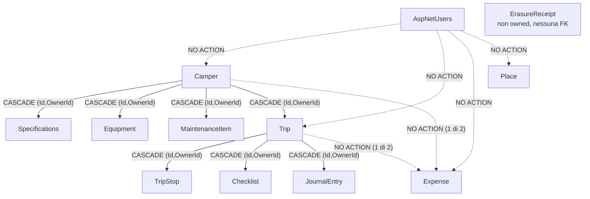

# Roamly — Database e persistenza

Stato: attivo · Ultimo aggiornamento: 2026-09-24
Origine: `docs/archive/Roamly_Planning_2026-09-24.md` §18 — **corretto** secondo review C1

---

## 1. Scelta del database

**Microsoft SQL Server.** Il database applicativo è SQL Server. **PostgreSQL non viene utilizzato.**

Motivazioni:

- ottima integrazione con C# e ASP.NET Core;
- Entity Framework Core maturo;
- SQL relazionale completo;
- supporto ai dati geografici tramite SQL Server Spatial;
- tooling e diagnostica solidi;
- competenze esistenti.

> **Tradeoff dichiarato** (dettaglio completo in [`../adr/0001-use-sql-server.md`](../adr/0001-use-sql-server.md)):
> SQL Server Spatial è **oggettivamente più debole di PostGIS** su geografia avanzata: niente KNN indicizzato componibile, niente clustering (`ST_ClusterDBSCAN`), niente vector tiles (`ST_AsMVT`), niente trasformazioni SRID native.
> La scelta è difendibile per l'integrazione .NET e le competenze esistenti, ma è un **tradeoff consapevole, non un pareggio**.
>
> **Due precisazioni che evitano di sopravvalutare il tradeoff:**
> - la debolezza *su routing* è in gran parte **irrilevante per Roamly**, perché il routing arriverà da un provider esterno (decisione #3), non dal database. pgRouting sarebbe rilevante solo self-hostando un motore su dati OSM, strada non imboccata;
> - l'immagine Docker **non è più pesante a causa di spatial**: il supporto spaziale è incluso nativamente nell'immagine Linux a costo zero. La pesantezza è di SQL Server in sé.

### Correzione applicata (C1)

Il planning originale dichiarava SQL Server in §3 e §18, ma PostgreSQL/PostGIS sopravviveva nel diagramma di architettura, nel docker compose, nella roadmap Phase 0, nella tabella delle decisioni (§27) e nel nome dell'ADR. Tutti questi punti sono stati allineati a SQL Server in questa riorganizzazione.

### Tipi spaziali: rimandati

> ✅ **Decisione #1 chiusa il 2026-09-24** → [`ADR-0001`](../adr/0001-use-sql-server.md).

**NetTopologySuite e i tipi spaziali non sono adottati nella v1.** Il pacchetto esiste ed è allineato a EF Core 10, ma nessuna feature dell'MVP 1.0 o della 1.1 ha un carico geospaziale che lo giustifichi, mentre il suo costo si pagherebbe subito su migration, test e correttezza SRID.

L'upgrade a `geography` SRID 4326 è **pre-approvato** al verificarsi di uno dei trigger documentati nell'ADR. Il percorso di migration è additivo e non comporta perdita di dati.

---

## 2. Regole di persistenza

- migrations versionate;
- foreign keys e constraints espliciti;
- indici progettati sulle query reali, non "per sicurezza";
- audit fields dove utili;
- **UTC** per tutte le date/time persistite;
- `decimal` per gli importi — **con valuta esplicita** (`Money`, vedi `CONTEXT.md`), mai un decimal nudo;
- `rowversion` / concurrency control dove utile, coerente con gli ETag dell'API;
- spatial types: **non usati in v1** — vedi [`ADR-0001`](../adr/0001-use-sql-server.md);
- coordinate: `Latitude decimal(8,6)` / `Longitude decimal(9,6)` in **WGS84**, modellate come **complex type** `Coordinates` (EF Core 10) — *emendamento ad [`ADR-0001`](../adr/0001-use-sql-server.md), 2026-09-24: non owned type, perché un value object non deve comparire nei verificatori di ownership ed erasure*;
- nessuna logica geografica critica che viva solo nel frontend;
- unità canoniche: **km**, **litri**, **kg**, **metri**, **gradi decimali WGS84**.

### Regole introdotte da [`ADR-0004`](../adr/0004-privacy-and-erasure.md)

- **`CreatedAtUtc` obbligatorio** (`datetime2`, NOT NULL, UTC) su **ogni** entità owned. Non è un "audit field dove utile": senza, nessuna politica di retention è esprimibile a posteriori. Aggiungerlo dopo costa un backfill su dati per cui il valore vero **non esiste più**;
- **`OwnerId → AspNetUsers(Id)` è sempre `ON DELETE NO ACTION`**, senza eccezioni;
- il **cascade esiste solo lungo la gerarchia di dominio**, sulle FK composite `(OwnerId, ParentId) → Parent(OwnerId, Id)` già imposte da R4 — con `OwnerId` come **prima** colonna, R29;
- **una sola cascade path per coppia di tabelle.** Il caso `Expense` è ora risolto dal domain model: `CamperId` è **obbligatorio e in cascade**, `TripId` è **opzionale e `NO ACTION`** — non `SET NULL`, che conta anch'esso come percorso. La cancellazione del viaggio slega le spese esplicitamente nel job. Niente trigger;
- **nessun soft delete di privacy.** Se servirà un cestino, è una funzionalità di prodotto e va chiamata con un altro nome.

### Regole introdotte dal domain model (2026-09-24, @archimedes)

Tre fatti che ADR-0003 e ADR-0004 non avevano dichiarato e che cambiano la forma dello schema:

- 🔴 **`ON DELETE SET NULL` conta come percorso di cascade** ai fini dell'errore 1785. Era la via di fuga implicita per le FK opzionali: **non esiste**. Una FK opzionale su un'entità già raggiungibile per un'altra strada deve essere `NO ACTION`, e la cancellazione va gestita esplicitamente nel job.
- 🔴 **Esiste un secondo caso 1785, mai tracciato prima**: `Trip → JournalEntry` e `Trip → TripStop → JournalEntry` sono **due percorsi** verso la stessa tabella. Riguarda entità di fasi successive, quindi non si manifesterebbe nella prima migration — ma si manifesterebbe mesi dopo, quando correggerlo costa molto di più. Per questo esiste il test di §2.2.
- ~~⚠️ **Le FK composite impongono un `UNIQUE (Id, OwnerId)` su ogni tabella-padre.**~~ ✅ **Requisito eliminato il 2026-09-25** da [`ADR-0008`](../adr/0008-primary-key-strategy.md): con **PK composita `(OwnerId, Id)`** le FK composite referenziano direttamente la chiave primaria, che è già un vincolo di unicità. Le sei chiavi alternate previste **non servono più**. È il caso in cui la decisione giusta ha tolto un costo invece di aggiungerne uno.

### 2.3 Chiave primaria

> ✅ **Decisa il 2026-09-25** → [`ADR-0008`](../adr/0008-primary-key-strategy.md).

**PK composita `(OwnerId, Id)` CLUSTERED** su ogni entità owned. `Id` è un `Guid` generato **client-side** da un helper di dominio che produce valori sequenziali **nell'ordinamento di SQL Server** (COMB), con `ValueGeneratedNever()`.

- ❌ **`Guid.CreateVersion7()` non è sequenziale negli indici SQL Server.** SQL Server confronta gli `uniqueidentifier` in 5 gruppi trattando i **byte 10-15 come i più significativi**, mentre l'RFC 9562 colloca il timestamp nei **primi 6 byte** — cioè dove SQL Server guarda per ultimo. La causa è l'**ordinamento di confronto di SQL Server**, non il layout di `System.Guid`: nessuna versione futura di .NET lo risolverà.
- `CreatedAtUtc` **non** entra nella clustering key: sta in indici non clusterizzati solo dove una query reale lo usa.
- Nessun indice aggiuntivo per garantire l'unicità globale di `Id`: l'unicità probabilistica del `Guid` è sufficiente.

### 2.4 Test dello schema completo

> 📎 Questa sezione era numerata **§2.2** fino al 2026-09-25, ed è citata come tale in [`ADR-0008`](../adr/0008-primary-key-strategy.md) e [`ADR-0009`](../adr/0009-test-strategy.md): l'inserimento di §2.3 (chiave primaria) l'ha spostata. Gli ADR non si modificano dopo l'approvazione, quindi il rimando resta valido qui.

> **Regola:** la prima migration crea **solo le tabelle della Phase 1**, ma un test costruisce lo **schema completo** — incluse le entità delle fasi successive — su un **SQL Server reale**.

Il motivo è che entrambi i casi 1785 noti coinvolgono entità future. Senza questo test, la verifica della topologia resta **analitica**: corretta sulla carta e non dimostrata. È la prima attività tecnica del progetto, e ha avuto una conseguenza di sequenza — ha reso la **decisione #6** (provisioning del DB di test) un prerequisito pratico, chiuso in [`ADR-0009`](../adr/0009-test-strategy.md).

Lo stesso test copre un secondo difetto della stessa famiglia: **R43** ([`ADR-0008`](../adr/0008-primary-key-strategy.md)) richiede che EF Core emetta le colonne della clausola `REFERENCES` **nell'ordine corretto**. Un ordine invertito genera uno schema che si crea senza errori ma che vincola le colonne sbagliate: a differenza di 1785, **non fallisce affatto**. È il caso peggiore dei due, e si vede solo leggendo lo schema creato.

Non introdurre un database separato per CQRS finché non esiste una necessità concreta.

---

## 2.1 Strategia di prossimità

Finché vale l'ADR-0001, la ricerca "luoghi entro N km" si fa in tre passi:

1. filtro `WHERE OwnerId = @me` — riduce già a poche migliaia di righe;
2. **bounding box** in SQL su `Latitude BETWEEN ... AND Longitude BETWEEN ...`, con indice composito `(OwnerId, Latitude, Longitude)` → index seek.
   Il delta di longitudine va corretto per la latitudine (1° di longitudine ≈ 111 km all'equatore, ≈ 74 km a Roma, ≈ 62 km a Oslo);
3. **affinamento Haversine in C#** sulle righe residue, per eliminare gli angoli del rettangolo.

La utility di distanza vive in `Common/` ed è coperta da unit test puri, senza database.

### Limiti noti e accettati

| Limite | Impatto |
|---|---|
| Haversine sbaglia fino a ~0,5% vs modello ellissoidale | Irrilevante: la distanza in linea d'aria è già una stima grossolana di quella stradale (1,2-1,4×), dichiarata come stima in UI |
| Bug all'antimeridiano (±180°) e ai poli | Non gestiti. Accettabile per un prodotto europeo, ma è un limite **non testato, non inesistente** |
| L'indice composito non è un indice 2D | Seek sulla latitudine, residual filter sulla longitudine. Invisibile a migliaia di righe, visibile a milioni |
| Nessun contenimento punto-in-poligono | Richiede `geography` → è il trigger 4 dell'ADR-0001 |

---

## 3. Seed data

Le checklist tipiche e le manutenzioni standard sono **contenuto di prodotto**, non dati di test: vanno versionate e gestite come seed controllato e idempotente.

I seed di luoghi non costruiscono geometrie: sono coppie lat/lon. Semplificazione derivata dall'ADR-0001.

---

## 4. Read model della dashboard

`GET /api/v1/dashboard` aggrega 6-7 fonti. Va progettata come **una query dedicata con projection**, misurata, non come composizione di N query per widget. Owner: @oracle.

---

## 5. Migration in deploy

Regola: **mai `Database.Migrate()` all'avvio in produzione.**

Usare `dotnet ef migrations bundle` come step controllato della pipeline, con backup e piano di rollback. Dettagli in `docs/architecture/DEVOPS.md`.

Finché vale l'ADR-0001 **nessuna migration contiene SQL manuale**, quindi il bundle copre il 100% dei casi. Al momento dell'eventuale upgrade a `geography` questo cesserà di essere vero: l'indice spaziale richiede `migrationBuilder.Sql` scritto a mano, perché **EF Core non genera indici spaziali** (`dotnet/efcore#12538`).

> ⚠️ **La prima migration va eseguita su un SQL Server vero prima di essere considerata valida.** L'errore **1785** (percorsi di cascade multipli) non emerge in `migrations add`: lo script si genera correttamente e fallisce **all'esecuzione**. Vedi §6.

---

## 6. Il grafo di cancellazione

> Origine: [`ADR-0004`](../adr/0004-privacy-and-erasure.md). **Questo è il documento che impedisce di rompere l'erasure modificando una relazione.** Va riletto ogni volta che si aggiunge o si modifica una relazione padre-figlio.

### Perché i rami tratteggiati sono `NO ACTION`

**Errore SQL Server 1785.** Con `OwnerId` denormalizzato su ogni figlio, ogni entità figlia avrebbe **due** percorsi di cascade verso `AspNetUsers` — quello diretto via `OwnerId` e quello gerarchico via il padre. Il motore ne tollera **uno solo** e rifiuta la creazione della constraint. `NO ACTION` sul percorso diretto lascia in piedi solo quello gerarchico.

### Le linee piene non costano nulla

Il `CASCADE` viaggia sulla **stessa FK composita** `(ParentId, OwnerId)` che implementa R4 (ADR-0003). Una sola constraint serve due scopi: impedire la divergenza di `OwnerId` e propagare la cancellazione. Nessun costo aggiuntivo rispetto ad ADR-0003.

### Conseguenza operativa

`DELETE FROM AspNetUsers WHERE Id = @x` **fallisce** finché esistono righe owned. La cancellazione di un account è una **sequenza ordinata**, non una `DELETE`. L'ordine è foglie → radice, con `AspNetUsers` per ultimo, ed è **derivato dal modello** (`IEntityType.GetForeignKeys()`): si calcola, non si scrive a mano. Una lista scritta a mano invecchia, un ordinamento topologico no.

Con la **PK composita `(OwnerId, Id)` CLUSTERED** ([`ADR-0008`](../adr/0008-primary-key-strategy.md)) ogni `DELETE ... WHERE OwnerId = @x` è un **range seek su righe fisicamente contigue**, invece di una scansione sparsa su tutto l'indice.

> ⚠️ **Il beneficio da citare è l'isolamento, non la velocità.** A ~10³ righe per utente la differenza di tempo è irrilevante: nessuno dei due piani è un problema. Ciò che conta è che le pagine toccate dalla cancellazione di un utente appartengano **solo a quell'utente** — quindi il lavoro non sporca la buffer pool né i lock di tutti gli altri. Su un'operazione che per definizione arriva a ondate, è la proprietà giusta da avere.

### Due nodi ancora condizionati da `CONTEXT.md`

- **`Expense`** ha entrambe le FK in `NO ACTION` *se* @archimedes sceglie "due FK nullable" (§3.3). Se sceglie "una tabella per contesto" (`CamperExpense`/`TripExpense`), il vincolo **decade** e quelle tabelle tornano in cascade. **ADR-0004 non pregiudica la scelta di modellazione.**
- **`Place`** è isolato perché §3.2 è aperta: se diventasse un POI condiviso, uscirebbe da `IOwnedResource` e da questo grafo. È un caso da **gestire**, non da scoprire.

---

## 7. Indici non clusterizzati

> Fonte: [`ADR-0008`](../adr/0008-primary-key-strategy.md). **Regola: nessun indice senza una query che lo giustifichi.** Ogni riga di questa tabella nomina la query servita; se la query sparisce, sparisce l'indice.

La clustering key `(OwnerId, Id)` serve già da sola tutte le letture per chiave e tutte le scansioni owner-scoped. Gli indici qui sotto esistono solo dove una query **ordina o filtra per un campo diverso da `Id`**.

| Entità | Indice | Query servita | Fase |
|---|---|---|---|
| `OdometerReading` | `(OwnerId, CamperId, ReadAtUtc DESC)` | lettura corrente del contachilometri per il `Ribbon`: `TOP 1` per camper | 🟢 Phase 1 |
| `OdometerReading` | `UNIQUE (OwnerId, CamperId, TakenOnUtc)` | vincolo di dominio "una lettura al giorno", non una query | 🟢 Phase 1 |
| `MaintenanceItem` | `(OwnerId, NextDueAtUtc)` | scadenze imminenti in dashboard, ordinate per urgenza | 🟢 Phase 1 |
| `Expense` | `(OwnerId, SpentOn DESC)` | Cost Management: spese per periodo | 🟡 Phase 2 |

> ⚠️ **Ogni indice non clusterizzato porta con sé la clustering key come puntatore alla riga: 32 byte** (`OwnerId` 16 + `Id` 16), contro gli 8 di una PK `bigint`. È il costo reale della scelta, e si paga **per ogni indice, per ogni riga** — non una volta sola. È la ragione per cui questa tabella è corta e va tenuta corta: qui la disciplina "nessun indice speculativo" non è igiene, è aritmetica.

> Non aggiungere un indice su `CreatedAtUtc`: **nessuna query di prodotto ordina per data di creazione**. È stata la ragione per cui `CreatedAtUtc` è rimasto fuori dalla clustering key (ADR-0008); reintrodurlo come indice separato rifarebbe lo stesso errore con un nome diverso.
